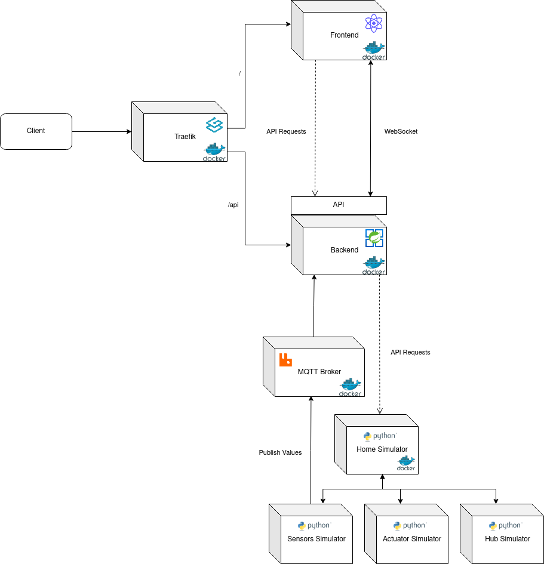
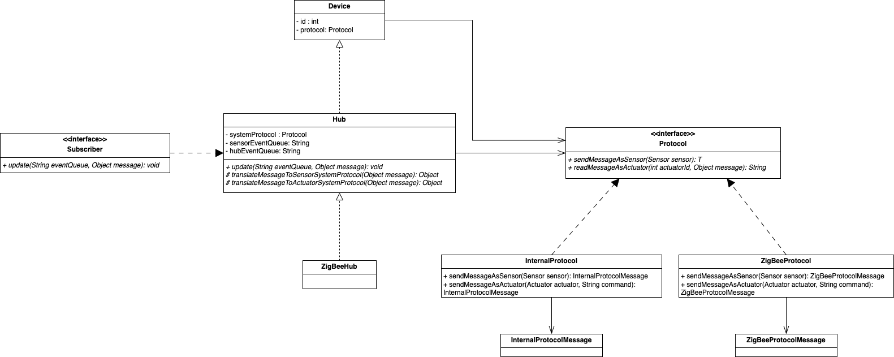
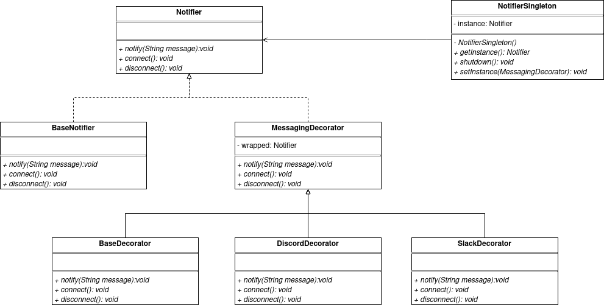
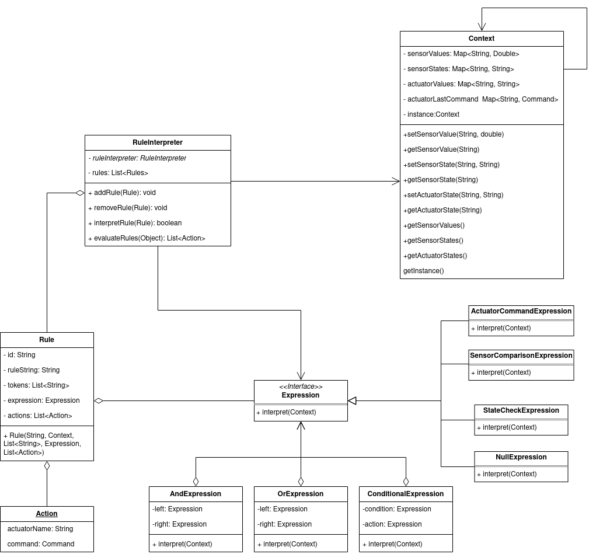
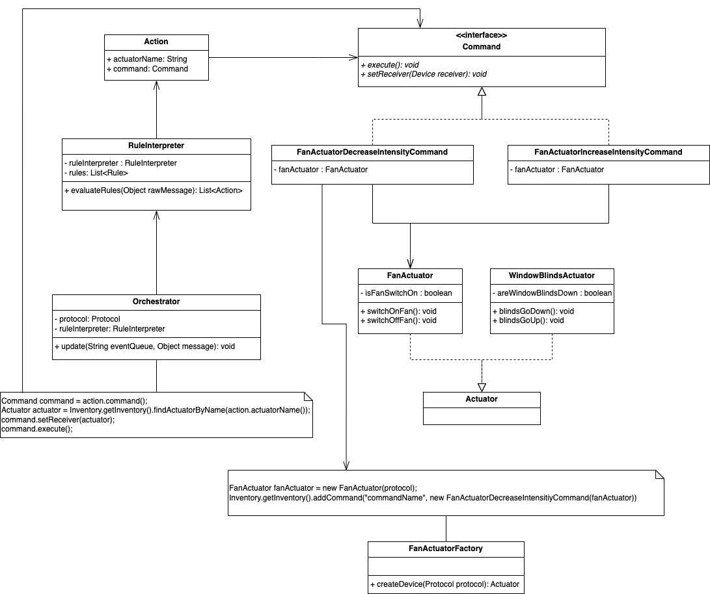
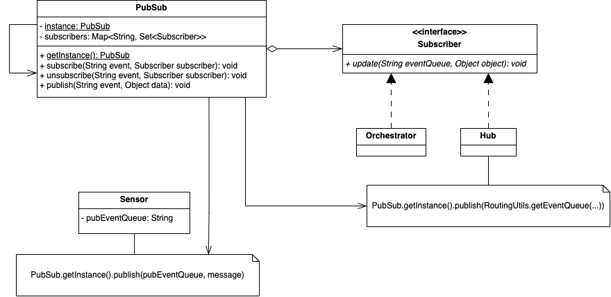
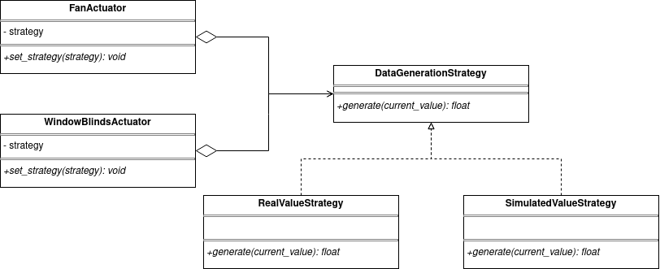
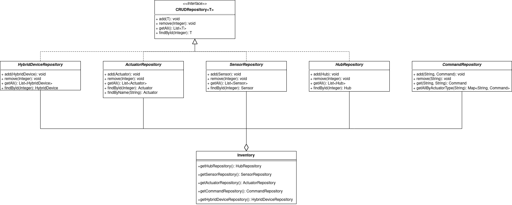
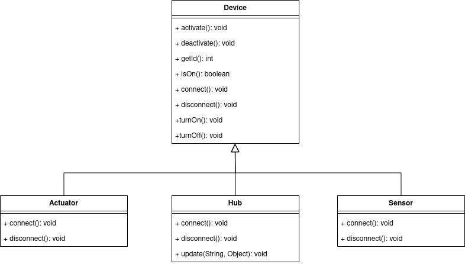

# **HomeMaestro - T2T1**

This project is a software system for managing and orchestrating interactions between various IoT devices (sensors, actuators, and hubs) using a publish-subscribe pattern, rules-based actions, and repository management. The system supports multiple communication protocols and utilizes several design patterns for modular and scalable implementation.

---

## DEMO

[Video Demo of the NAZUS HomeMaestro](https://youtu.be/WlPqq_Pw0uU)

## **1. High-Level Architecture**

1. **Device Management Layer**: Manages all device types.
2. **Protocol Management Layer**: Facilitates communication protocols, allowing devices to interact.
3. **Event and Rule Management Layer**: Supports event-driven communication through a publish-subscribe model, enabling devices to trigger rules and actions.
4. **Data Storage Layer**: Uses repositories to manage device storage and retrieval.

This is the Architecture & Design diagram for NAZUS HomeMaestro:

The client interacts with the system through the _Frontend_ layer, which communicates with the _Backend_ layer using a REST API and WebSockets for real-time updates. The _Backend_ layer contains the **Device Management**, **Protocol Management**, **Event and Rule Management**, and **Data Storage** layers, which work together to manage devices, protocols, events, rules, and data storage.

In order to meet the goal: "Work in simulated mode, with virtual (software) devices, and be easy to extend to work in real-world mode, connecting to the actual devices", we decided to implement a seperate layer, _Home Simulator_, that can create virtual devices (sensors, actuators and hubs) and simulate their behaviour. In this virtual environment, the Actuators can change the parameters of the Home (like the temperature, the light, etc) and the Sensors can read these parameters and send them to the system through a MQTT Broker.

Additionally, we employed the **Model-View-Controller (MVC) Architectural Pattern** to build our system. In this pattern
- The **View** is represented by the frontend, which provides the user interface.
- The **Model** and **Controllers** are represented by the backend. We have developed REST API controllers to facilitate communication between the frontend and the backend. The models encompass the rest of the backend, where various design patterns are applied to manage device interactions, rule interpretation, data storage, etc.

This separation of concerns ensures a modular and scalable architecture, making the system easy to maintain and extend.

---

## **2. The Design of NAZUS HomeMaestro**

### **2.1. Device Creation**

**Problem in Context**

The HomeMaestro system encompasses many devices ranging from sensors, to actuators and hubs. However, inside of each device category there is also the possibility of existing many other types of specific sensors, actuators or hubs.

Although some types of specific devices might be thought of in the early developments and can be implemented, it is still unclear how many, if any, will be added in the future due to the vast universe of IoT devices.

So our source code must be open for change in an easy, intuitive and respectful of the SOLID principles way.

**The Pattern**

The **Factory Method Design Pattern** is capable of solving this problem by creating an abstract structure based on polymorphism with a combination of abstract factories, concrete factories, abstract products and concrete products. This pattern then allows when facing the need to add a new type of device, instead of altering existent code, we just have to create two additional classes.

In our concrete implementation this is how the pattern roles, operations and associations were mapped:

- Abstract Products: [`Device`](https://github.com/MESW-ADS-2425/HomeMaestro-T2T1/blob/main/hm-backend/homemaestro/src/main/java/pt/up/feup/homemaestro/devices/Device.java), [`Actuator`](https://github.com/MESW-ADS-2425/HomeMaestro-T2T1/blob/main/hm-backend/homemaestro/src/main/java/pt/up/feup/homemaestro/devices/actuators/Actuator.java), [`Sensor`](https://github.com/MESW-ADS-2425/HomeMaestro-T2T1/blob/main/hm-backend/homemaestro/src/main/java/pt/up/feup/homemaestro/devices/sensors/Sensor.java) and [`Hub`](https://github.com/MESW-ADS-2425/HomeMaestro-T2T1/blob/main/hm-backend/homemaestro/src/main/java/pt/up/feup/homemaestro/devices/hubs/Hub.java)
- Concrete Products: [`TemperatureSensor`](https://github.com/MESW-ADS-2425/HomeMaestro-T2T1/blob/main/hm-backend/homemaestro/src/main/java/pt/up/feup/homemaestro/devices/sensors/concrete/products/TemperatureSensor.java), [`LightSensor`](https://github.com/MESW-ADS-2425/HomeMaestro-T2T1/blob/main/hm-backend/homemaestro/src/main/java/pt/up/feup/homemaestro/devices/sensors/concrete/products/LightSensor.java), [`FanActuator`](https://github.com/MESW-ADS-2425/HomeMaestro-T2T1/blob/main/hm-backend/homemaestro/src/main/java/pt/up/feup/homemaestro/devices/actuators/concrete/products/FanActuator.java), [`WindowBlindsActuator`](https://github.com/MESW-ADS-2425/HomeMaestro-T2T1/blob/main/hm-backend/homemaestro/src/main/java/pt/up/feup/homemaestro/devices/actuators/concrete/products/WindowBlindsActuator.java), [`ZigBeeHub`](https://github.com/MESW-ADS-2425/HomeMaestro-T2T1/blob/main/hm-backend/homemaestro/src/main/java/pt/up/feup/homemaestro/devices/hubs/concrete/products/ZigBeeHub.java)
- Abstract Factories: [`DeviceFactory`](https://github.com/MESW-ADS-2425/HomeMaestro-T2T1/blob/main/hm-backend/homemaestro/src/main/java/pt/up/feup/homemaestro/devices/DeviceFactory.java), [`ActuatorFactory`](https://github.com/MESW-ADS-2425/HomeMaestro-T2T1/blob/main/hm-backend/homemaestro/src/main/java/pt/up/feup/homemaestro/devices/actuators/ActuatorFactory.java), [`SensorFactory`](https://github.com/MESW-ADS-2425/HomeMaestro-T2T1/blob/main/hm-backend/homemaestro/src/main/java/pt/up/feup/homemaestro/devices/sensors/SensorFactory.java) and [`HubFactory`](https://github.com/MESW-ADS-2425/HomeMaestro-T2T1/blob/main/hm-backend/homemaestro/src/main/java/pt/up/feup/homemaestro/devices/hubs/HubFactory.java)
- Concrete Factories: [`TemperatureSensorFactory`](https://github.com/MESW-ADS-2425/HomeMaestro-T2T1/blob/main/hm-backend/homemaestro/src/main/java/pt/up/feup/homemaestro/devices/sensors/concrete/factories/TemperatureSensorFactory.java), [`LightSensorFactory`](https://github.com/MESW-ADS-2425/HomeMaestro-T2T1/blob/main/hm-backend/homemaestro/src/main/java/pt/up/feup/homemaestro/devices/sensors/concrete/factories/LightSensorFactory.java), [`FanActuatorFactory`](https://github.com/MESW-ADS-2425/HomeMaestro-T2T1/blob/main/hm-backend/homemaestro/src/main/java/pt/up/feup/homemaestro/devices/actuators/concrete/factories/FanActuatorFactory.java), [`WindowBlindsActuatorFactory`](https://github.com/MESW-ADS-2425/HomeMaestro-T2T1/blob/main/hm-backend/homemaestro/src/main/java/pt/up/feup/homemaestro/devices/actuators/concrete/factories/WindowBlindsActuatorFactory.java), [`ZigBeeHubFactory`](https://github.com/MESW-ADS-2425/HomeMaestro-T2T1/blob/main/hm-backend/homemaestro/src/main/java/pt/up/feup/homemaestro/devices/hubs/concrete/factories/ZigBeeHubFactory.java)
- Factory Method: [`createDevice(Protocol<?> protocol)`](https://github.com/MESW-ADS-2425/HomeMaestro-T2T1/blob/main/hm-backend/homemaestro/src/main/java/pt/up/feup/homemaestro/devices/DeviceFactory.java#L6)

Since our class hierarchy has two levels of abstraction, meaning [`Actuator`](https://github.com/MESW-ADS-2425/HomeMaestro-T2T1/blob/main/hm-backend/homemaestro/src/main/java/pt/up/feup/homemaestro/devices/actuators/Actuator.java), [`Sensor`](https://github.com/MESW-ADS-2425/HomeMaestro-T2T1/blob/main/hm-backend/homemaestro/src/main/java/pt/up/feup/homemaestro/devices/sensors/Sensor.java) and [`Hub`](https://github.com/MESW-ADS-2425/HomeMaestro-T2T1/blob/main/hm-backend/homemaestro/src/main/java/pt/up/feup/homemaestro/devices/hubs/Hub.java) all extend [`Device`](https://github.com/MESW-ADS-2425/HomeMaestro-T2T1/blob/main/hm-backend/homemaestro/src/main/java/pt/up/feup/homemaestro/devices/Device.java), but then [`TemperatureSensor`](https://github.com/MESW-ADS-2425/HomeMaestro-T2T1/blob/main/hm-backend/homemaestro/src/main/java/pt/up/feup/homemaestro/devices/sensors/concrete/products/TemperatureSensor.java), [`FanActuator`](https://github.com/MESW-ADS-2425/HomeMaestro-T2T1/blob/main/hm-backend/homemaestro/src/main/java/pt/up/feup/homemaestro/devices/actuators/concrete/products/FanActuator.java) and others extend [`Sensor`](https://github.com/MESW-ADS-2425/HomeMaestro-T2T1/blob/main/hm-backend/homemaestro/src/main/java/pt/up/feup/homemaestro/devices/sensors/Sensor.java) and [`Actuator`](https://github.com/MESW-ADS-2425/HomeMaestro-T2T1/blob/main/hm-backend/homemaestro/src/main/java/pt/up/feup/homemaestro/devices/actuators/Actuator.java), respectively, then we had to implement also a two levels of abstraction factory, meaning [`ActuatorFactory`](https://github.com/MESW-ADS-2425/HomeMaestro-T2T1/blob/main/hm-backend/homemaestro/src/main/java/pt/up/feup/homemaestro/devices/actuators/ActuatorFactory.java), [`SensorFactory`](https://github.com/MESW-ADS-2425/HomeMaestro-T2T1/blob/main/hm-backend/homemaestro/src/main/java/pt/up/feup/homemaestro/devices/sensors/SensorFactory.java) and [`HubFactory`](https://github.com/MESW-ADS-2425/HomeMaestro-T2T1/blob/main/hm-backend/homemaestro/src/main/java/pt/up/feup/homemaestro/devices/hubs/HubFactory.java) are abstract and extend [`DeviceFactory`](https://github.com/MESW-ADS-2425/HomeMaestro-T2T1/blob/main/hm-backend/homemaestro/src/main/java/pt/up/feup/homemaestro/devices/DeviceFactory.java), and then the more specific factories like [`TemperatureSensorFactory`](https://github.com/MESW-ADS-2425/HomeMaestro-T2T1/blob/main/hm-backend/homemaestro/src/main/java/pt/up/feup/homemaestro/devices/sensors/concrete/factories/TemperatureSensorFactory.java) extend [`SensorFactory`](https://github.com/MESW-ADS-2425/HomeMaestro-T2T1/blob/main/hm-backend/homemaestro/src/main/java/pt/up/feup/homemaestro/devices/sensors/SensorFactory.java) and override the abstract factory method.

This is a UML class diagram that ilustrates our implementation:

**Consequences**

By implementing the **Factory Method Design Pattern** we avoid tight coupling between the DeviceFactory and the concrete Devices, while also respecting the Single Responsibility Principle and the Open/Closed Principle.

This way we can add new types of devices without needing to change existent logic by only adding two new classes. However, a downside of using this pattern is that it can quickly increase significantly the number of classes which can damage code maintenance and simplicity.

A similar alternative design pattern is the Builder which could have been useful if we decided to create "macro" device type classes that had a lot of possible "constructor" combinations. Then it would be possible to create in a dynamic way specific combinations that represented a specific device, like in our example, a TemperatureSensor, which would reduce the number of classes created substantially in comparison with the Factory Method pattern.

However, since we decided to separate devices into their more specific version, the builder does not suit well on simple class constructors.

### **2.2. Device Communication Protocol**

**Problem in Context**

Each [`Device`](https://github.com/MESW-ADS-2425/HomeMaestro-T2T1/blob/main/hm-backend/homemaestro/src/main/java/pt/up/feup/homemaestro/devices/Device.java) only knows how to communicate using a specific [`Protocol`](https://github.com/MESW-ADS-2425/HomeMaestro-T2T1/blob/main/hm-backend/homemaestro/src/main/java/pt/up/feup/homemaestro/protocols/Protocol.java). A protocol has an associated protocol message class that defines the structure of the messages and two defined communication methods, namely [`sendMessageAsSensor`](https://github.com/MESW-ADS-2425/HomeMaestro-T2T1/blob/main/hm-backend/homemaestro/src/main/java/pt/up/feup/homemaestro/protocols/Protocol.java#L8) and [`sendMessageAsActuator`](https://github.com/MESW-ADS-2425/HomeMaestro-T2T1/blob/main/hm-backend/homemaestro/src/main/java/pt/up/feup/homemaestro/protocols/Protocol.java#L10).

In our communication structure, we defined the [`Orchestrator`](https://github.com/MESW-ADS-2425/HomeMaestro-T2T1/blob/main/hm-backend/homemaestro/src/main/java/pt/up/feup/homemaestro/orchestrators/Orchestrator.java) as responsible for receiving sensor value's updates and triggering Actuator commands. Since the [`Orchestrator`](https://github.com/MESW-ADS-2425/HomeMaestro-T2T1/blob/main/hm-backend/homemaestro/src/main/java/pt/up/feup/homemaestro/orchestrators/Orchestrator.java) belongs to the HomeMaestro system and it is a fixed component, the [`Orchestrator`](https://github.com/MESW-ADS-2425/HomeMaestro-T2T1/blob/main/hm-backend/homemaestro/src/main/java/pt/up/feup/homemaestro/orchestrators/Orchestrator.java) solely understands and communicates using the default system protocol, namely [`InternalProtocol`](https://github.com/MESW-ADS-2425/HomeMaestro-T2T1/blob/main/hm-backend/homemaestro/src/main/java/pt/up/feup/homemaestro/protocols/InternalProtocol.java).

The problem arises when there are devices with different protocols that must interact with the [`Orchestrator`](https://github.com/MESW-ADS-2425/HomeMaestro-T2T1/blob/main/hm-backend/homemaestro/src/main/java/pt/up/feup/homemaestro/orchestrators/Orchestrator.java). For example, when a sensor with a [`ZigbeeProtocol`](https://github.com/MESW-ADS-2425/HomeMaestro-T2T1/blob/main/hm-backend/homemaestro/src/main/java/pt/up/feup/homemaestro/protocols/zigbee/ZigBeeProtocol.java) protocol sends an event, how will the [`Orchestrator`](https://github.com/MESW-ADS-2425/HomeMaestro-T2T1/blob/main/hm-backend/homemaestro/src/main/java/pt/up/feup/homemaestro/orchestrators/Orchestrator.java) be able to extract the message's content?

**The Pattern**

To solve this communication problem, we implemented the **Adapter Design Pattern**. The Adapter consists of a class that acts as an intermediate between two incompatible interfaces, with the goal of allowing them two to collaborate.

In the strict definition of the Gang Of Four implementation of the Adapter, in the "Object adapter" implementation the adapter class must wrap one of the incompatible interfaces, make some necessary conversions and invoke a method from the wrapped interface. In the "Class adapter" implementation, it no longer wraps one of the incompatible interfaces, but it extends both of them, nonetheless it still makes the necessary conversions and invokes one of the inherited methods.

In our implementation, we were not able to follow the pattern in the GoF strict sense, because we built our device communication system over a Publish/Subscribe layer that decouples the devices, so essentially, what our Adapter implementation does is intersects a message in a specific protocol and then translates the message into another specific protocol.

We implemented the **Adapter Design Pattern** by creating the abstract [`Hub`](https://github.com/MESW-ADS-2425/HomeMaestro-T2T1/blob/main/hm-backend/homemaestro/src/main/java/pt/up/feup/homemaestro/devices/hubs/Hub.java) class (it is abstract because of the hub creation which was explained in the previous section) that defines two abstract methods [`translateMessageToSensorSystemProtocol`](https://github.com/MESW-ADS-2425/HomeMaestro-T2T1/blob/main/hm-backend/homemaestro/src/main/java/pt/up/feup/homemaestro/devices/hubs/Hub.java#L79) and [`translateMessageToActuatorSystemProtocol`](https://github.com/MESW-ADS-2425/HomeMaestro-T2T1/blob/main/hm-backend/homemaestro/src/main/java/pt/up/feup/homemaestro/devices/hubs/Hub.java#L81) which are the adapter's data conversion methods, the class also holds two instances of [`Protocol`](https://github.com/MESW-ADS-2425/HomeMaestro-T2T1/blob/main/hm-backend/homemaestro/src/main/java/pt/up/feup/homemaestro/protocols/Protocol.java), namely [`protocol`](https://github.com/MESW-ADS-2425/HomeMaestro-T2T1/blob/main/hm-backend/homemaestro/src/main/java/pt/up/feup/homemaestro/devices/hubs/Hub.java#L22) and [`systemProtocol`](https://github.com/MESW-ADS-2425/HomeMaestro-T2T1/blob/main/hm-backend/homemaestro/src/main/java/pt/up/feup/homemaestro/devices/hubs/Hub.java#L16) which are the incompatible interfaces. Lastly, since the [`Hub`](https://github.com/MESW-ADS-2425/HomeMaestro-T2T1/blob/main/hm-backend/homemaestro/src/main/java/pt/up/feup/homemaestro/devices/hubs/Hub.java) implements the [`Subscriber`](https://github.com/MESW-ADS-2425/HomeMaestro-T2T1/blob/main/hm-backend/homemaestro/src/main/java/pt/up/feup/homemaestro/pubsub/Subscriber.java) interface, it implements the [`update`](https://github.com/MESW-ADS-2425/HomeMaestro-T2T1/blob/main/hm-backend/homemaestro/src/main/java/pt/up/feup/homemaestro/pubsub/Subscriber.java#L4) method, which would map to the invokation of the wrapped incompatible interface.

This is a UML class diagram that ilustrates our implementation:

**Consequences**

By implementing the **Adapter Design Pattern** we have a flexible solution, capable of being extended in the future with other concrete hubs, but without needing to change previous code (it respects the Open-Closed principle). In addition, it increases the system's interoperability and support regarding new protocols. However, a possible liability of our implementation is having the protocol conversion logic too coupled with the concrete hub implementation and also too dependent on the system protocol staying consistent throughout the SDLC. If a specific protocol changes or if the system protocol changes, a change to the concrete hub implementation is needed.

### **2.3. Integration with Communication Systems**

**Problem in Context**

The HomeMaestro system needs to be capable of integrating with well-known communication platforms such as Discord, Slack, WhatsApp, and others. This integration is essential for providing real-time notifications, alerts, and interactions with users. The system should be able to send messages and updates about the status of home automation devices, such as sensors and actuators, to these platforms.

The integration should be seamless and flexible, allowing for easy addition of new communication platforms as needed. This ensures that users can interact with their home automation system using their preferred communication tools, enhancing the overall user experience and accessibility of the system.

**The Pattern**

To achieve this integration, we employed a combination of the **Decorator Design Pattern** and **Singleton Design Pattern**. The **Decorator Design Pattern** allows us to dynamically add functionalities to the notifier without modifying the base classes. We have a base decorator, [`BaseDecorator`](https://github.com/MESW-ADS-2425/HomeMaestro-T2T1/blob/main/hm-backend/homemaestro/src/main/java/pt/up/feup/homemaestro/communication/decorator/BaseDecorator.java), that can then be wrapped by other decorators for different communication platforms, such as [`SlackDecorator`](https://github.com/MESW-ADS-2425/HomeMaestro-T2T1/blob/main/hm-backend/homemaestro/src/main/java/pt/up/feup/homemaestro/communication/decorator/SlackDecorator.java) and [`DiscordDecorator`](https://github.com/MESW-ADS-2425/HomeMaestro-T2T1/blob/main/hm-backend/homemaestro/src/main/java/pt/up/feup/homemaestro/communication/decorator/DiscordDecorator.java), this way we can send messages to various platforms simultaniously if that is what we want from the system. These Decorator implementations extend the abstract class [`MessagingDecorator`](https://github.com/MESW-ADS-2425/HomeMaestro-T2T1/blob/main/hm-backend/homemaestro/src/main/java/pt/up/feup/homemaestro/communication/decorator/MessagingDecorator.java), which serves as a base for the Decorators and implements the [`Notifier`](https://github.com/MESW-ADS-2425/HomeMaestro-T2T1/blob/main/hm-backend/homemaestro/src/main/java/pt/up/feup/homemaestro/communication/Notifier.java) interface. The [`BaseNotifier`](https://github.com/MESW-ADS-2425/HomeMaestro-T2T1/blob/main/hm-backend/homemaestro/src/main/java/pt/up/feup/homemaestro/communication/BaseNotifier.java) also implements the [`Notifier`](https://github.com/MESW-ADS-2425/HomeMaestro-T2T1/blob/main/hm-backend/homemaestro/src/main/java/pt/up/feup/homemaestro/communication/Notifier.java) interface, and it has the purpose of being the base class for the decorators to wrap.

The **Singleton Design Pattern** ensures that there is only one instance of the notifier throughout the application. This is crucial for managing the connection and disconnection to communication platforms efficiently. The [`NotifierSingleton`](https://github.com/MESW-ADS-2425/HomeMaestro-T2T1/blob/main/hm-backend/homemaestro/src/main/java/pt/up/feup/homemaestro/communication/singleton/NotifierSingleton.java) class manages the single instance of the notifier and provides a global access point to it.

However, our implementation of the **Singleton Design Pattern** is slightly adapted. Instead of having an instance of itself, the [`NotifierSingleton`](https://github.com/MESW-ADS-2425/HomeMaestro-T2T1/blob/main/hm-backend/homemaestro/src/main/java/pt/up/feup/homemaestro/communication/singleton/NotifierSingleton.java) manages an instance of a [`Notifier`](https://github.com/MESW-ADS-2425/HomeMaestro-T2T1/blob/main/hm-backend/homemaestro/src/main/java/pt/up/feup/homemaestro/communication/Notifier.java). Even though it is not implemented as a traditional Singleton, we thought it was important to have this pattern because there should only exist one [`Notifier`](https://github.com/MESW-ADS-2425/HomeMaestro-T2T1/blob/main/hm-backend/homemaestro/src/main/java/pt/up/feup/homemaestro/communication/Notifier.java) at a time. Having multiple instances could lead to errors with the connection, disconnection, and notification of the multiple communication systems. Therefore, having just one instance is crucial.

A setter method is provided in the [`NotifierSingleton`](https://github.com/MESW-ADS-2425/HomeMaestro-T2T1/blob/main/hm-backend/homemaestro/src/main/java/pt/up/feup/homemaestro/communication/singleton/NotifierSingleton.java) class to change the notifier being used. This approach allows the user to change the type of notifier if needed, without violating the Open/Closed Principle. The setter method allows for easy replacement of the notifier instance with a different implementation.

This is a UML class diagram that illustrates our implementation of the Decorator and Singleton Design Patterns:

**Consequences**

By combining these design patterns, we achieved a robust and flexible integration with communication systems. The **Decorator Design Pattern** enhances maintainability by separating concerns, and allowing the user to receive messages from more than one platform at a time. The **Singleton Design Pattern** ensures centralized control and efficient management of the notifier instance. The use of a setter method for changing the notifier provides flexibility and extensibility without modifying existing code.

However, the use of multiple design patterns can increase the complexity of the codebase. Additionally, managing connections and disconnections for each notification might introduce some overhead. Despite these challenges, the combination of these patterns provides a flexible and extensible way to integrate with multiple communication platforms, ensuring that the HomeMaestro system can provide real-time notifications and interactions with users through their preferred communication tools. Additionally, if a new communication platform is added in the future, it can be easily integrated by creating a new decorator class that can wrap or be wrapped by the existing decorators.

### **2.4 Rules Interpretation**

#### Problem in Context

The Home Maestro system needs to evaluate dynamic rules and trigger corresponding actions in real-time based on device-generated events. These rules encapsulate conditions such as “if the temperature exceeds a threshold, then increase fan intensity” or “if the light in the room is less then a certain value, bring the window blinds down.”

The system should process these rules efficiently, considering current device states, and execute actions accordingly, ensuring adaptability to changing conditions without hardcoding behaviors.

#### The Pattern

To solve this, we employed the **Interpreter Design Pattern**, which is ideal for defining and interpreting a DSL (domain-specific language). This pattern separates the grammar of the rules into manageable components and provides an interpreter to evaluate them.

Rules are encapsulated in the [`Rule`](https://github.com/MESW-ADS-2425/HomeMaestro-T2T1/blob/main/hm-backend/homemaestro/src/main/java/pt/up/feup/homemaestro/interpreter/Rule.java) class, which contains:

- Conditions: Logical expressions to evaluate device states or measurements.
- Actions: Commands to modify actuator states when the condition is true.
  Starting so with a token

In our Interpreter implementation, we use **Expressions** to match and process parts of the rule string provided by the user. To improve the organisation and efficiency of interpreting these rules, we have adopted the **Composite Design Pattern**. This design choice is particularly appropriate because the **Interpreter Design Pattern** often works on sentences that can be systematically broken down into smaller, more manageable components.

For example, consider a rule such as

`if temperatureSensor1 <= 12.3 and lightSensor4 > 165.0 then fanActuator2 on.`.

This rule can be broken down into two main parts:

1. **The condition:** `if temperatureSensor1 <= 12.3 and lightSensor4 > 165.0`.
2. **The action:** `then fanActuator2 on`.

Furthermore, the condition itself can be broken down into individual expressions, such as

- `temperatureSensor1 <= 12.3`.
- `LightSensor4 > 165.0`.

This hierarchical structure aligns seamlessly with the **Composite Design Pattern**. By treating both individual expressions and their combinations in the same way, the **Composite Design Pattern** simplifies the interpretation process. It allows us to construct and analyse complex rules in a clear, recursive manner, where each composite is a logical aggregation of its constituent parts. This uniformity not only streamlines implementation, but also improves the maintainability and extensibility of the system.

The **Interpreter** is mainly divided by three parts:

1. **Abstract Expression**: The [`Expression`](https://github.com/MESW-ADS-2425/HomeMaestro-T2T1/blob/main/hm-backend/homemaestro/src/main/java/pt/up/feup/homemaestro/interpreter/expression/Expression.java) interface defines the base for all expressions in the grammar.
2. **Terminal Expressions**: Represent the atomic elements of the language, such as sensor comparisons and actuator commands.
   - [`StateCheckExpression`](https://github.com/MESW-ADS-2425/HomeMaestro-T2T1/blob/main/hm-backend/homemaestro/src/main/java/pt/up/feup/homemaestro/interpreter/expression/StateCheckExpression.java)
   - [`NullExpression`](https://github.com/MESW-ADS-2425/HomeMaestro-T2T1/blob/main/hm-backend/homemaestro/src/main/java/pt/up/feup/homemaestro/interpreter/expression/NullExpression.java)
   - [`SensorComparisonExpression`](https://github.com/MESW-ADS-2425/HomeMaestro-T2T1/blob/main/hm-backend/homemaestro/src/main/java/pt/up/feup/homemaestro/interpreter/expression/SensorComparisonExpression.java)
   - [`ActuatorCommandExpression`](https://github.com/MESW-ADS-2425/HomeMaestro-T2T1/blob/main/hm-backend/homemaestro/src/main/java/pt/up/feup/homemaestro/interpreter/expression/ActuatorCommandExpression.java)
3. **Non-Terminal Expression**: Represent combinations of expressions to enable complex rule logic.
   - [`AndExpression`](https://github.com/MESW-ADS-2425/HomeMaestro-T2T1/blob/main/hm-backend/homemaestro/src/main/java/pt/up/feup/homemaestro/interpreter/expression/AndExpression.java)
   - [`OrExpression`](https://github.com/MESW-ADS-2425/HomeMaestro-T2T1/blob/main/hm-backend/homemaestro/src/main/java/pt/up/feup/homemaestro/interpreter/expression/OrExpression.java)
   - [`ConditionalExpression`](https://github.com/MESW-ADS-2425/HomeMaestro-T2T1/blob/main/hm-backend/homemaestro/src/main/java/pt/up/feup/homemaestro/interpreter/expression/ConditionalExpression.java)

The [`NullExpression`](https://github.com/MESW-ADS-2425/HomeMaestro-T2T1/blob/main/hm-backend/homemaestro/src/main/java/pt/up/feup/homemaestro/interpreter/expression/NullExpression.java) implements the **Null Object Design Pattern**, so that if no other Expression applies, this takes place and always returns false in the [`interpret()`](https://github.com/MESW-ADS-2425/HomeMaestro-T2T1/blob/main/hm-backend/homemaestro/src/main/java/pt/up/feup/homemaestro/interpreter/expression/NullExpression.java) method, indicating it is not an interpretable Rule.

In our implementation, we set rules through an expression by a sequence of tasks:

1. **Tokenization**: The rule string is tokenized into a list of tokens.
2. **Parsing**: The tokens are parsed into an abstract syntax tree (AST) where is retrieved the actions and the Expression.
3. **Interpretation**: The AST is interpreted to evaluate the rule.

Each [`Action`](https://github.com/MESW-ADS-2425/HomeMaestro-T2T1/blob/main/hm-backend/homemaestro/src/main/java/pt/up/feup/homemaestro/interpreter/Action.java) is a command executed by an actuator. That logic is represented with the **Command Design Pattern** that will be explained in another section.

Additionally, the Interpreter typically has an associated **Context**, that, in its core, applies the **Context Design Pattern**. The [`Context`](https://github.com/MESW-ADS-2425/HomeMaestro-T2T1/blob/main/hm-backend/homemaestro/src/main/java/pt/up/feup/homemaestro/interpreter/Context.java) class contains global information that is maintained and modified during the interpretation process. This may include variables, data structures, or other state information that the interpreter needs to access or modify while interpreting expressions.

In our implementation, the [`Context`](https://github.com/MESW-ADS-2425/HomeMaestro-T2T1/blob/main/hm-backend/homemaestro/src/main/java/pt/up/feup/homemaestro/interpreter/Context.java) includes:

- [`Map<String, Double> sensorValues`](https://github.com/MESW-ADS-2425/HomeMaestro-T2T1/blob/main/hm-backend/homemaestro/src/main/java/pt/up/feup/homemaestro/interpreter/Context.java#L8)  
  Stores the current values of various sensors, enabling the interpreter to evaluate conditions based on real-time data.

- [`Map<String, String> sensorStates`](https://github.com/MESW-ADS-2425/HomeMaestro-T2T1/blob/main/hm-backend/homemaestro/src/main/java/pt/up/feup/homemaestro/interpreter/Context.java#L9)  
  Stores the states of the sensors, such as whether they are "on," "off,"."

- [`Map<String, String> actuatorStates`](https://github.com/MESW-ADS-2425/HomeMaestro-T2T1/blob/main/hm-backend/homemaestro/src/main/java/pt/up/feup/homemaestro/interpreter/Context.java#L10)  
  Stores the current states of actuators, such as "on," "off," or other specified actions.

- [`Map<String, Command> actuatorLastCommand`](https://github.com/MESW-ADS-2425/HomeMaestro-T2T1/blob/main/hm-backend/homemaestro/src/main/java/pt/up/feup/homemaestro/interpreter/Context.java#L11)
  Stores the last command executed by each actuator, enabling the interpreter to track and manage actuator actions.

These elements are critical for interpreting rules and making the necessary adjustments during the interpretation process.

Since the information in the [`Context`](https://github.com/MESW-ADS-2425/HomeMaestro-T2T1/blob/main/hm-backend/homemaestro/src/main/java/pt/up/feup/homemaestro/interpreter/Context.java) is relevant to all rules, we implemented it using the **Singleton Design Pattern**. This ensures the following:

- There is a single instance of the [`Context`](https://github.com/MESW-ADS-2425/HomeMaestro-T2T1/blob/main/hm-backend/homemaestro/src/main/java/pt/up/feup/homemaestro/interpreter/Context.java) class throughout the application.
- Shared states and values are consistently available across all rules.
- Access to the [`Context`](https://github.com/MESW-ADS-2425/HomeMaestro-T2T1/blob/main/hm-backend/homemaestro/src/main/java/pt/up/feup/homemaestro/interpreter/Context.java) is simplified, avoiding duplication and ensuring uniformity of global information.

By combining the **Singleton Design Pattern** with the Interpreter and Composite Patterns, we create a cohesive and efficient architecture for rule interpretation and execution.

This is a UML class diagram that illustrates our implementation of the **Interpreter Design Pattern**:

**Consequences**

The **Interpreter Design Pattern** provides a flexible and extensible way to evaluate rules and trigger actions based on device-generated events. By separating the grammar of the rules into manageable components, the system can efficiently process dynamic rules and adapt to changing conditions without hardcoding behaviors.
Interpreter Pattern
However, the use of the **Interpreter Design Pattern** can increase the complexity of the codebase, especially when defining complex rules with multiple conditions and actions. The **Interpreter Design Pattern** provides a powerful mechanism for defining and interpreting a DSL for rule evaluation and action triggering in the Home Maestro system.

### **2.5 Actuator Commands Execution**

**Problem in Context**

In our system, the [`Actuator`](https://github.com/MESW-ADS-2425/HomeMaestro-T2T1/blob/main/hm-backend/homemaestro/src/main/java/pt/up/feup/homemaestro/devices/actuators/Actuator.java) is responsible for performing specific operations on specific situations, for example a specific [`Sensor`](https://github.com/MESW-ADS-2425/HomeMaestro-T2T1/blob/main/hm-backend/homemaestro/src/main/java/pt/up/feup/homemaestro/devices/sensors/Sensor.java) measurement value is reached, or maybe a combination of sensor values and actuator states is met. These conditions and what should happen on each scenario is documented in our [`Rule`](https://github.com/MESW-ADS-2425/HomeMaestro-T2T1/blob/main/hm-backend/homemaestro/src/main/java/pt/up/feup/homemaestro/interpreter/Rule.java) class that, when interpreted, as seen in the previous section, returns a list of executable actions.

Having the actions needed to be performed, the problem lies in how does the [`Actuator`](https://github.com/MESW-ADS-2425/HomeMaestro-T2T1/blob/main/hm-backend/homemaestro/src/main/java/pt/up/feup/homemaestro/devices/actuators/Actuator.java) know when it has to perform those actions and, additionally, who should be in charge of instructing the actuators to do them?

**The Pattern**

To solve this problem, we decided to implement the **Command Design Pattern** which consists of encapsulating a set of operations into a single command class that holds a reference to a command receiver, the entity which will perform the set of specific operations. In addition, the pattern also introduces the concept of the invoker, which will be the entity responsible for executing a command instance.

In our concrete implementation this is how the pattern roles, operations and associations were mapped:

- Command Interface: [`Command`](https://github.com/MESW-ADS-2425/HomeMaestro-T2T1/blob/main/hm-backend/homemaestro/src/main/java/pt/up/feup/homemaestro/commands/Command.java)
- Concrete Commands: [`FanActuatorIncreaseIntensityCommand`](https://github.com/MESW-ADS-2425/HomeMaestro-T2T1/blob/main/hm-backend/homemaestro/src/main/java/pt/up/feup/homemaestro/commands/concrete/fanactuator/FanActuatorIncreaseIntensityCommand.java), [`FanActuatorDecreaseIntensityCommand`](https://github.com/MESW-ADS-2425/HomeMaestro-T2T1/blob/main/hm-backend/homemaestro/src/main/java/pt/up/feup/homemaestro/commands/concrete/fanactuator/FanActuatorDecreaseIntensityCommand.java), ...
- Receivers: [`FanActuator`](https://github.com/MESW-ADS-2425/HomeMaestro-T2T1/blob/main/hm-backend/homemaestro/src/main/java/pt/up/feup/homemaestro/devices/actuators/concrete/products/FanActuator.java), [`WindowBlindsActuator`](https://github.com/MESW-ADS-2425/HomeMaestro-T2T1/blob/main/hm-backend/homemaestro/src/main/java/pt/up/feup/homemaestro/devices/actuators/concrete/products/WindowBlindsActuator.java)
- Invoker: [`Orchestrator`](https://github.com/MESW-ADS-2425/HomeMaestro-T2T1/blob/main/hm-backend/homemaestro/src/main/java/pt/up/feup/homemaestro/orchestrators/Orchestrator.java)
- Invoker Execute Command: [`update`](https://github.com/MESW-ADS-2425/HomeMaestro-T2T1/blob/main/hm-backend/homemaestro/src/main/java/pt/up/feup/homemaestro/pubsub/Subscriber.java#L4)
- Command Initializer: [`FanActuatorFactory`](https://github.com/MESW-ADS-2425/HomeMaestro-T2T1/blob/main/hm-backend/homemaestro/src/main/java/pt/up/feup/homemaestro/devices/actuators/concrete/factories/FanActuatorFactory.java), [`WindowBlindsActuatorFactory`](https://github.com/MESW-ADS-2425/HomeMaestro-T2T1/blob/main/hm-backend/homemaestro/src/main/java/pt/up/feup/homemaestro/devices/actuators/concrete/factories/WindowBlindsActuatorFactory.java)
- Command Storage: [`Inventory`](https://github.com/MESW-ADS-2425/HomeMaestro-T2T1/blob/main/hm-backend/homemaestro/src/main/java/pt/up/feup/homemaestro/repository/Inventory.java)
- Instructs what commands should be executed: [`RuleInterpreter`](https://github.com/MESW-ADS-2425/HomeMaestro-T2T1/blob/main/hm-backend/homemaestro/src/main/java/pt/up/feup/homemaestro/interpreter/RuleInterpreter.java)

Some additional classes and adaptations were made to the strict GoF **Command Design Pattern**, namely, the invoker ([`Orchestrator`](https://github.com/MESW-ADS-2425/HomeMaestro-T2T1/blob/main/hm-backend/homemaestro/src/main/java/pt/up/feup/homemaestro/orchestrators/Orchestrator.java)) does not hold a reference to the command instance because it gets directly a list of commands to execute from the [`RuleInterpreter`](https://github.com/MESW-ADS-2425/HomeMaestro-T2T1/blob/main/hm-backend/homemaestro/src/main/java/pt/up/feup/homemaestro/interpreter/RuleInterpreter.java) when the [`update`](https://github.com/MESW-ADS-2425/HomeMaestro-T2T1/blob/main/hm-backend/homemaestro/src/main/java/pt/up/feup/homemaestro/pubsub/Subscriber.java#L4) method is invoked. For the same reason, the [`Orchestrator`](https://github.com/MESW-ADS-2425/HomeMaestro-T2T1/blob/main/hm-backend/homemaestro/src/main/java/pt/up/feup/homemaestro/orchestrators/Orchestrator.java) does not have a command instance setter.

Since in the GoF **Command Design Pattern** there is a clear 1:1 relationship between a concrete command instance and a receiver instance because it only allows to set the receiver instance via the constructor (making it immutable), when the number of receiver instances increases, in our case, when more actuators are added to the system, the number of concrete commands instances might increase exponentially depending on the number of associated commands to the specific actuator. In order to avoid this and reduce the number of command instances held in memory, we thought of creating a [`Map<String, Command> commands`](https://github.com/MESW-ADS-2425/HomeMaestro-T2T1/blob/main/hm-backend/homemaestro/src/main/java/pt/up/feup/homemaestro/repository/Inventory.java#L20) structure inside of the [`Inventory`](https://github.com/MESW-ADS-2425/HomeMaestro-T2T1/blob/main/hm-backend/homemaestro/src/main/java/pt/up/feup/homemaestro/repository/Inventory.java) class that holds just one instance of [`Command`](https://github.com/MESW-ADS-2425/HomeMaestro-T2T1/blob/main/hm-backend/homemaestro/src/main/java/pt/up/feup/homemaestro/commands/Command.java) per command. The [`Parser`](https://github.com/MESW-ADS-2425/HomeMaestro-T2T1/blob/main/hm-backend/homemaestro/src/main/java/pt/up/feup/homemaestro/interpreter/Parser.java) class then uses this structure to build an [`Action`](https://github.com/MESW-ADS-2425/HomeMaestro-T2T1/blob/main/hm-backend/homemaestro/src/main/java/pt/up/feup/homemaestro/interpreter/Action.java) with the correct [`Command`](https://github.com/MESW-ADS-2425/HomeMaestro-T2T1/blob/main/hm-backend/homemaestro/src/main/java/pt/up/feup/homemaestro/commands/Command.java) reference. However, we had to add the [`setReceiver(Device receiver)`](https://github.com/MESW-ADS-2425/HomeMaestro-T2T1/blob/main/hm-backend/homemaestro/src/main/java/pt/up/feup/homemaestro/commands/Command.java#L7) method to point to the right [`Actuator`](https://github.com/MESW-ADS-2425/HomeMaestro-T2T1/blob/main/hm-backend/homemaestro/src/main/java/pt/up/feup/homemaestro/devices/actuators/Actuator.java) class before executing the command. The [`Orchestrator`](https://github.com/MESW-ADS-2425/HomeMaestro-T2T1/blob/main/hm-backend/homemaestro/src/main/java/pt/up/feup/homemaestro/orchestrators/Orchestrator.java) with the information held in [`Action`](https://github.com/MESW-ADS-2425/HomeMaestro-T2T1/blob/main/hm-backend/homemaestro/src/main/java/pt/up/feup/homemaestro/interpreter/Action.java) is responsible to set the right receiver.

This is a UML class diagram that illustrates our implementation of the **Interpreter Design Pattern**:

**Consequences**

By implementing the **Command Design Pattern** we respect the Single Responsability Principle, since we encapsulate all command and operations logic inside of a single class, and the Open/Closed Principle, since we allow to add new [`Command`](https://github.com/MESW-ADS-2425/HomeMaestro-T2T1/blob/main/hm-backend/homemaestro/src/main/java/pt/up/feup/homemaestro/commands/Command.java) classes without needing to alter existant code (although in the concrete factory we need to initialize the new commands since we passed some of the pattern's client responsibility to the factory).

The Command also allows us to assemble a set of simple operations into a more complex one and also simplify the communication between the [`Orchestrator`](https://github.com/MESW-ADS-2425/HomeMaestro-T2T1/blob/main/hm-backend/homemaestro/src/main/java/pt/up/feup/homemaestro/orchestrators/Orchestrator.java) and the [`Actuator`](https://github.com/MESW-ADS-2425/HomeMaestro-T2T1/blob/main/hm-backend/homemaestro/src/main/java/pt/up/feup/homemaestro/devices/actuators/Actuator.java), without needing to use the Publish/Subscribe layer.

A possible liability of the pattern is that it leads to the creation of many classes, which with time can increase the complexity and overhead of the codebase which can make it difficult to maintain and navigate in.

### **2.6 Device Communication Layer**

**Problem in Context**

System Devices naturally interact between each other, it is the core of the system's functionality, since sensors must be capable of sending their measurements, the orchestrator must be capable of receiving meaningful and understandable data to evaluate which operations should be performed and hubs must be capable of intersecting messages and convert them to the correct format.

So what is the best approach to build this needed device communication layer?

**The Pattern**

The clear candidate is the **Observer** pattern which consists of declaring two type of classes, namely, the publisher and the subscriber. The publisher holds a list of references of subscribers that are interested in the publisher's state and want to be notified when this state changes. When the state eventually changes, the list of subscribers is iterated and their update method is invoked passing as an argument the needed context to perform additional operations.

One disadvantage of implementing the Observer pattern in the classical and strict GoF sense is that the publishers and subscribers are tightly coupled. Thus, we opted to implement a variation of the Observer pattern, inspired by the **Publish/Subscribe Design Paradigm**.

In our implementation, instead of having the publisher hold a list with the references of the subscribers, we created a middle class, namely [`PubSub`](https://github.com/MESW-ADS-2425/HomeMaestro-T2T1/blob/main/hm-backend/homemaestro/src/main/java/pt/up/feup/homemaestro/pubsub/PubSub.java) that holds all the needed information inside of a [`Map<String, Set<Subscribers>> subscribers`](https://github.com/MESW-ADS-2425/HomeMaestro-T2T1/blob/main/hm-backend/homemaestro/src/main/java/pt/up/feup/homemaestro/pubsub/PubSub.java#L14) map. Here, the [`Subscriber`](https://github.com/MESW-ADS-2425/HomeMaestro-T2T1/blob/main/hm-backend/homemaestro/src/main/java/pt/up/feup/homemaestro/pubsub/Subscriber.java) instances are not interested in a specific publisher instance, but instead in a specific [`event`](https://github.com/MESW-ADS-2425/HomeMaestro-T2T1/blob/main/hm-backend/homemaestro/src/main/java/pt/up/feup/homemaestro/pubsub/Subscriber.java#L4) queue, represented by a string. Then, when something is triggered and changes the publisher's state, instead of invoking the [`update`](https://github.com/MESW-ADS-2425/HomeMaestro-T2T1/blob/main/hm-backend/homemaestro/src/main/java/pt/up/feup/homemaestro/pubsub/Subscriber.java#L4) method of each [`Subscriber`](https://github.com/MESW-ADS-2425/HomeMaestro-T2T1/blob/main/hm-backend/homemaestro/src/main/java/pt/up/feup/homemaestro/pubsub/Subscriber.java) directly, it invokes the [`publish`](https://github.com/MESW-ADS-2425/HomeMaestro-T2T1/blob/main/hm-backend/homemaestro/src/main/java/pt/up/feup/homemaestro/pubsub/PubSub.java#L34-L37) method of the [`PubSub`](https://github.com/MESW-ADS-2425/HomeMaestro-T2T1/blob/main/hm-backend/homemaestro/src/main/java/pt/up/feup/homemaestro/pubsub/PubSub.java) passing the associated event queue and the corresponding context data. The [`PubSub`](https://github.com/MESW-ADS-2425/HomeMaestro-T2T1/blob/main/hm-backend/homemaestro/src/main/java/pt/up/feup/homemaestro/pubsub/PubSub.java) is then responsible for notifying all the event queue subscribers by invoking their [`update`](https://github.com/MESW-ADS-2425/HomeMaestro-T2T1/blob/main/hm-backend/homemaestro/src/main/java/pt/up/feup/homemaestro/pubsub/Subscriber.java#L4) method.

To enforce centralization of this communication processes, we made the [`PubSub`](https://github.com/MESW-ADS-2425/HomeMaestro-T2T1/blob/main/hm-backend/homemaestro/src/main/java/pt/up/feup/homemaestro/pubsub/PubSub.java) into a **Singleton**, this way we ensure that the subscribers' map is consistent throughout the system's runtime.

In our concrete implementation this is how the pattern roles, operations and associations were mapped:

- Subscriber Interface: [`Subscriber`](https://github.com/MESW-ADS-2425/HomeMaestro-T2T1/blob/main/hm-backend/homemaestro/src/main/java/pt/up/feup/homemaestro/pubsub/Subscriber.java)
- Subscribers: [`Hub`](https://github.com/MESW-ADS-2425/HomeMaestro-T2T1/blob/main/hm-backend/homemaestro/src/main/java/pt/up/feup/homemaestro/devices/hubs/Hub.java) and [`Orchestrator`](https://github.com/MESW-ADS-2425/HomeMaestro-T2T1/blob/main/hm-backend/homemaestro/src/main/java/pt/up/feup/homemaestro/orchestrators/Orchestrator.java)
- Communication Middleman: [`PubSub`](https://github.com/MESW-ADS-2425/HomeMaestro-T2T1/blob/main/hm-backend/homemaestro/src/main/java/pt/up/feup/homemaestro/pubsub/PubSub.java)
- Publisher Method: [`publish`](https://github.com/MESW-ADS-2425/HomeMaestro-T2T1/blob/main/hm-backend/homemaestro/src/main/java/pt/up/feup/homemaestro/pubsub/PubSub.java#L34-L37) from [`PubSub`](https://github.com/MESW-ADS-2425/HomeMaestro-T2T1/blob/main/hm-backend/homemaestro/src/main/java/pt/up/feup/homemaestro/pubsub/PubSub.java)
- Publishers: [`Sensor`](https://github.com/MESW-ADS-2425/HomeMaestro-T2T1/blob/main/hm-backend/homemaestro/src/main/java/pt/up/feup/homemaestro/devices/sensors/Sensor.java) and [`Hub`](https://github.com/MESW-ADS-2425/HomeMaestro-T2T1/blob/main/hm-backend/homemaestro/src/main/java/pt/up/feup/homemaestro/devices/hubs/Hub.java)

This is a UML class diagram that illustrates our implementation of the aforementioned Observer Publish/Subscribe paradigm variation:

**Consequences**

With our implementation we created a flexible device communication solution, where if we need to add new type of Publishers or Subscribers, we do not have to change existant code. Additionally, the Publisher and Subscriber are decoupled, which means that changes in one or another does not influence each other.

This pattern implementation has some liabilities regarding scalability, if there are a lot of publishers and subscribers, the [`PubSub`](https://github.com/MESW-ADS-2425/HomeMaestro-T2T1/blob/main/hm-backend/homemaestro/src/main/java/pt/up/feup/homemaestro/pubsub/PubSub.java) class can become a bottleneck due to the lack of parallel processing with possibly threads. Since the communication is synchronous, there can be latency problems as well. In addition, it can also lead to misconfiguration problems, since it is vital that the subscriber and publisher are interacting with the intended event queue.

### **2.7. Simulating a Real-World vs Simulated Environment**

**Problem in Context**

The HomeMaestro system must be able to work in simulated mode, with virtual (software) devices, and be easily extended to work in real mode, with real devices connected. This is important for test and development purposes, as well as for future integration with physical devices.

To increase the versatility of the system, the virtual actuators should emulate real world behaviour by generating values that are close to reality. However, for testing and development purposes, a purely realistic simulation may not always be ideal. To address this, the simulated devices should offer two modes of operation: a realistic mode that mirrors the behaviour of real-world devices, and a simulation-focused mode where values change more abruptly, allowing developers to test the system under a wider range of conditions.

**The Pattern**

To meet this requirement, we have implemented the **Strategy Design Pattern**, which allows flexible selection and modification of the strategy used by the actuator to simulate values. This design choice allows seamless switching between different simulation modes, improving both the development and testing processes.

We have developed two different strategies: [`RealValueStrategy`](https://github.com/MESW-ADS-2425/HomeMaestro-T2T1/blob/main/hm-simulation/devices/actuators/strategy/realValueStrategy.py) and [`SimulatedValueStrategy`](https://github.com/MESW-ADS-2425/HomeMaestro-T2T1/blob/main/hm-simulation/devices/actuators/strategy/simulatedValueStrategy.py). The [`RealValueStrategy`](https://github.com/MESW-ADS-2425/HomeMaestro-T2T1/blob/main/hm-simulation/devices/actuators/strategy/realValueStrategy.py) generates values that closely mimic real-world behaviour, while the [`SimulatedValueStrategy`](https://github.com/MESW-ADS-2425/HomeMaestro-T2T1/blob/main/hm-simulation/devices/actuators/strategy/simulatedValueStrategy.py) generates values with greater variability and abrupt changes, facilitating faster rule triggering during testing. This dual approach ensures that the system is effective for both realistic simulations and accelerated development workflows.

Unlike other patterns used in the system, this implementation resides in the simulation layer of the architecture, which is written in Python as opposed to the Java-based core. While consolidating all design patterns in the backend would improve organisation and consistency, placing this particular implementation in the simulation layer is a more logical choice. This approach is consistent with the architecture of the system, as the virtual actuators responsible for simulating devices operate within the Python-based simulation layer. The chosen strategy generates values that are seamlessly passed to the rest of the system via virtual sensors, ensuring smooth integration and maintaining a cohesive flow between the simulation and the core components.

The **Strategy** is divided into three parts:

1. **Strategy Interface**: The [`DataGenerationStrategy`](https://github.com/MESW-ADS-2425/HomeMaestro-T2T1/blob/main/hm-simulation/devices/actuators/strategy/dataGenerationStrategy.py) interface defines the _generate()_ method that concrete strategies must implement.

2. **Concrete Strategies**: Actual strategies that implement the [`DataGenerationStrategy`](https://github.com/MESW-ADS-2425/HomeMaestro-T2T1/blob/main/hm-simulation/devices/actuators/strategy/dataGenerationStrategy.py) interface.

   - [`RealValueStrategy`](https://github.com/MESW-ADS-2425/HomeMaestro-T2T1/blob/main/hm-simulation/devices/actuators/strategy/realValueStrategy.py)
   - [`SimulatedValueStrategy`](https://github.com/MESW-ADS-2425/HomeMaestro-T2T1/blob/main/hm-simulation/devices/actuators/strategy/simulatedValueStrategy.py)

3. **Context**: The classes that use one of the concrete strategies, and have a method to change the strategy.
   - [`FanActuator`](https://github.com/MESW-ADS-2425/HomeMaestro-T2T1/blob/main/hm-backend/homemaestro/src/main/java/pt/up/feup/homemaestro/devices/actuators/concrete/products/FanActuator.java)
   - [`WindowBlindsActuator`](https://github.com/MESW-ADS-2425/HomeMaestro-T2T1/blob/main/hm-backend/homemaestro/src/main/java/pt/up/feup/homemaestro/devices/actuators/concrete/products/WindowBlindsActuator.java)

This is a UML class diagram that illustrates our implementation of the **Strategy Design Pattern**:

**Consequences**

The **Strategy Design Pattern** provides a flexible and extensible way to simulate real-world and accelerated device behaviour in the HomeMaestro system. By separating the simulation strategies into distinct classes, the system can easily switch between different modes of operation, improving both development and testing processes.

However, the use of the **Strategy Design Pattern** can increase the complexity of the codebase, especially when defining multiple strategies for simulating device behaviour. Additionally, managing the selection and modification of strategies might introduce some overhead. Despite these challenges, the **Strategy Design Pattern** provides a powerful mechanism for simulating device behaviour in the HomeMaestro system, ensuring that the system is effective for both realistic simulations and accelerated development workflows.

### **2.8. Device Management and Storage**

**Problem in Context**

The HomeMaestro system must be able to manage a wide range of devices, including sensors, actuators, hubs and commands. These devices need to be stored and accessed efficiently, allowing for easy retrieval and modification.

**The Pattern**

To address this requirement, we have implemented the **Repository Design Pattern**, which provides a standardized way to manage device data access. The **Repository Design Pattern** abstracts the data access layer, providing a consistent interface for performing CRUD (Create, Read, Update, Delete) operations on device entities. This approach simplifies device management and storage, ensuring that the system can efficiently handle device data.

In our implementation, we have created a [`CRUDRepository`](https://github.com/MESW-ADS-2425/HomeMaestro-T2T1/blob/main/hm-backend/homemaestro/src/main/java/pt/up/feup/homemaestro/repository/CRUDRepository.java) interface that defines the standard CRUD operations for device entities. This interface is then implemented by concrete repository classes from each type of Device, [`ActuatorRepository`](https://github.com/MESW-ADS-2425/HomeMaestro-T2T1/blob/main/hm-backend/homemaestro/src/main/java/pt/up/feup/homemaestro/repository/ActuatorRepository.java), [`SensorRepository`](https://github.com/MESW-ADS-2425/HomeMaestro-T2T1/blob/main/hm-backend/homemaestro/src/main/java/pt/up/feup/homemaestro/repository/SensorRepository.java), [`HubRepository`](https://github.com/MESW-ADS-2425/HomeMaestro-T2T1/blob/main/hm-backend/homemaestro/src/main/java/pt/up/feup/homemaestro/repository/HubRepository.java) and [`HybridDeviceRepository`](https://github.com/MESW-ADS-2425/HomeMaestro-T2T1/blob/main/hm-backend/homemaestro/src/main/java/pt/up/feup/homemaestro/repository/HybridDeviceRepository.java). Also, we created the [`CommandRepository`](https://github.com/MESW-ADS-2425/HomeMaestro-T2T1/blob/main/hm-backend/homemaestro/src/main/java/pt/up/feup/homemaestro/repository/CommandRepository.java), that does not implement the base device repository interface, since it is not a device, but a command.

Finally, we have a [`Inventory`](https://github.com/MESW-ADS-2425/HomeMaestro-T2T1/blob/main/hm-backend/homemaestro/src/main/java/pt/up/feup/homemaestro/repository/Inventory.java) class that acts as a central repository manager, providing a single point of access to all device repositories and to the command repository. This class is responsible for storing and coordinating the retrieval of device entities, ensuring that the system can efficiently manage device data.

This is a UML class diagram that illustrates our implementation of the **Repository Design Pattern**:

**Consequences**

The **Repository Design Pattern** provides a standardized and efficient way to manage device data in the HomeMaestro system. By abstracting the data access layer and providing a consistent interface for CRUD operations, the system can easily store and retrieve device entities, ensuring that device management is streamlined and efficient. This approach simplifies the implementation of device repositories and ensures that the system can scale to accommodate a wide range of devices.

However, the use of the **Repository Design Pattern** can introduce some specific challenges. For instance, while it provides a consistent interface for data access, it can lead to a proliferation of repository classes, especially as the system grows in complexity. This can make the codebase harder to navigate and maintain, as developers must manage multiple repositories with different responsibilities. Additionally, the **Repository Design Pattern** might introduce some overhead in managing the relationships between repositories and entities, especially when dealing with complex data structures. Despite these challenges, the **Repository Design Pattern** effectively centralizes device data access and management, ensuring that the HomeMaestro system can efficiently handle device entities.

### **2.9. Avoiding Code Duplication in the Devices**

**Problem in Context**

In the HomeMaestro system, we have multiple types of devices, such as sensors, actuators, and hubs. These devices share common functionalities, such as initialization and termination. However, implementing these functionalities separately for each device type can lead to code duplication and maintenance challenges.

**The Pattern**

To address this issue, we have implemented the **Template Method Design Pattern** in the [`Device`](https://github.com/MESW-ADS-2425/HomeMaestro-T2T1/blob/main/hm-backend/homemaestro/src/main/java/pt/up/feup/homemaestro/devices/Device.java) class. The **Template Method Design Pattern** defines a skeleton of an algorithm in the superclass but allows subclasses to override specific steps of the algorithm without changing its structure. In our implementation, the [`Device`](https://github.com/MESW-ADS-2425/HomeMaestro-T2T1/blob/main/hm-backend/homemaestro/src/main/java/pt/up/feup/homemaestro/devices/Device.java) class provides a two template methods: [`activate()`](https://github.com/MESW-ADS-2425/HomeMaestro-T2T1/blob/main/hm-backend/homemaestro/src/main/java/pt/up/feup/homemaestro/devices/Device.java#L28-L31) and [`deactivate()`](https://github.com/MESW-ADS-2425/HomeMaestro-T2T1/blob/main/hm-backend/homemaestro/src/main/java/pt/up/feup/homemaestro/devices/Device.java#L33-L36), which are common to all devices, and use the [`turnOn()`](https://github.com/MESW-ADS-2425/HomeMaestro-T2T1/blob/main/hm-backend/homemaestro/src/main/java/pt/up/feup/homemaestro/devices/Device.java#L72-L75) and [`turnOff()`](https://github.com/MESW-ADS-2425/HomeMaestro-T2T1/blob/main/hm-backend/homemaestro/src/main/java/pt/up/feup/homemaestro/devices/Device.java#L77-L80) methods, which are equal in any device and the [`connect()`](https://github.com/MESW-ADS-2425/HomeMaestro-T2T1/blob/main/hm-backend/homemaestro/src/main/java/pt/up/feup/homemaestro/devices/Device.java#L68) and [`disconnect()`](https://github.com/MESW-ADS-2425/HomeMaestro-T2T1/blob/main/hm-backend/homemaestro/src/main/java/pt/up/feup/homemaestro/devices/Device.java#L70) methods that are abstract and must be implemented by the subclasses. This approach ensures that common functionalities are implemented once in the superclass, reducing code duplication and improving maintainability. The subclasses, [`Sensor`](https://github.com/MESW-ADS-2425/HomeMaestro-T2T1/blob/main/hm-backend/homemaestro/src/main/java/pt/up/feup/homemaestro/devices/sensors/Sensor.java), [`Actuator`](https://github.com/MESW-ADS-2425/HomeMaestro-T2T1/blob/main/hm-backend/homemaestro/src/main/java/pt/up/feup/homemaestro/devices/actuators/Actuator.java), and [`Hub`](https://github.com/MESW-ADS-2425/HomeMaestro-T2T1/blob/main/hm-backend/homemaestro/src/main/java/pt/up/feup/homemaestro/devices/hubs/Hub.java), can then override these methods of the algorithm as needed.

This is a UML class diagram that illustrates our implementation of the **Template Method Design Pattern**:

**Consequences**

The **Template Method Design Pattern** provides a flexible and extensible way to avoid code duplication in the HomeMaestro system. By defining a common structure for device initialization and termination, the system can ensure consistent behavior across different device types. This approach simplifies the implementation of new device types and reduces the risk of errors due to code duplication.

However, the use of the **Template Method Design Pattern** can introduce some specific challenges. For instance, while it enforces a consistent initialization and termination process across different device types, it can lead to a rigid class structure where changes to the template method might necessitate modifications across multiple subclasses. This can make the system less flexible when accommodating new or unique device behaviors that deviate from the established template. Additionally, the pattern can increase the cognitive load on developers, as they must understand the abstract template and its concrete implementations. Despite these challenges, the **Template Method Design Pattern** effectively reduces code duplication by centralizing common logic, thereby enhancing maintainability and ensuring uniform behavior across the HomeMaestro system's diverse range of devices.

## Code Refactoring and Clean Up

### Code Smells Detected

While developing the HomeMaestro system, we identified several areas where the code could be refactored and cleaned up to improve readability, maintainability, and performance. Some code smells were identified during the development process, which prompted us to refactor the codebase, some of them were:
* **Long Parameter List**: Methods with a large number of parameters can be difficult to read and maintain. We refactored the Devices using the Factory Method Pattern.
* **Large Class**: The Inventory class was previously extensively big which leads us to do a refactoring where we applied the Repository Pattern.
* **Temporary Field**: We had some fields that were only used in a small portion of the code, so we refactored them to be used only when needed.
* **Duplicate Code**: We had some duplicated code in the Device class that was refactored to the Template Method Pattern.

### Refactorings Used

Here we have some of the refactorings that we used in order to improve the codebase:
* #### Extract Method
* #### Extract Variable
* #### Replace Temp with Query
* #### Extract Class
* #### Remove Middle Man
* #### Replace Conditional with Polymorphism
* #### Consolidate Duplicate Conditional Fragments
* #### Remove Parameter

We even used many other refactorings, but these were the most used and important ones. We refactored the codebase mostly in the end of the development but in the middle too, in order to avoid future problems and to make the code more readable and maintainable.

## **4. Conclusion**

In this project, we successfully designed and implemented the HomeMaestro system, which manages and orchestrates interactions between different IoT devices. By using multiple design patterns, we achieved a modular and scalable architecture that ensures maintainability and extensibility.

Throughout the development process, we learned a lot about software engineering best practices. The importance of design patterns became clear as they significantly improved our code organisation and development workflow. Implementing these patterns not only made our system more robust, but also highlighted the value of clean, maintainable code.

In addition, this project provided us with valuable lessons in refactoring and problem solving. The complexity of the subject matter challenged us to think critically and creatively, improving our skills in tackling complex software design issues.

Overall, the HomeMaestro project was a rewarding experience that deepened our understanding of design patterns and their practical applications. It reinforced the importance of good practice in software development and equipped us with the knowledge to approach future projects with confidence and expertise.