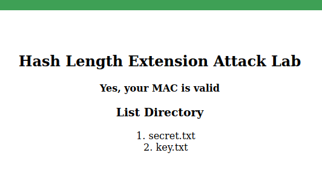
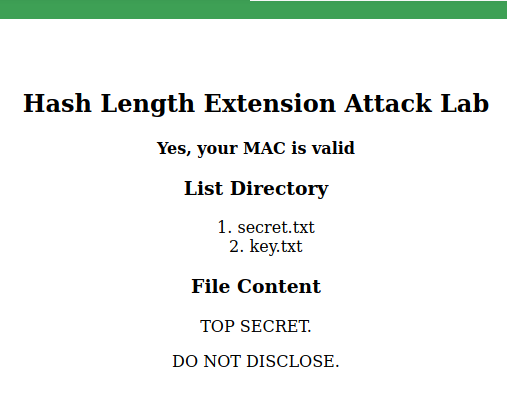
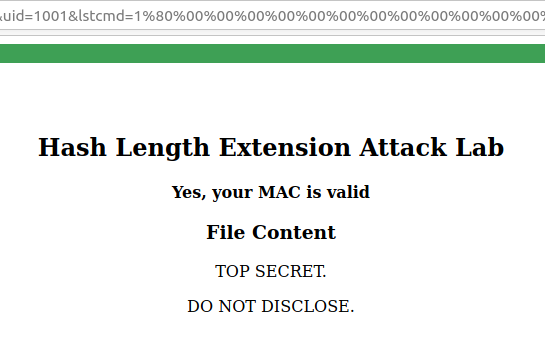
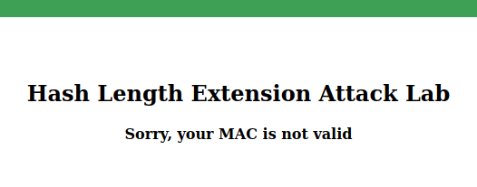

# Logbook for Lab 02

## Purpose

When a client and a server communicate over the internet, they are subject to MITM attacks.
An attacker can intercept the request from the client. The attacker may choose to modify the data and send the modified request to the server.

In such a scenario, the server needs to verify the integrity of the request received.
The standard way to verify the integrity of the request is to attach a tag called MAC to the request.
There are many ways to calculate MAC, and some of the methods are not secure.

MAC is calculated from a secret key and a message.
A naive way to calculate MAC is to concatenate the key with the message and calculate the one-way hash of the resulting string.
This method seems to be fine, but it is subject to an attack called a length extension attack,
which allows attackers to modify the message while still being able to generate a valid MAC based on the modified message,
without knowing the secret key.

The objective of this lab is to help students understand how the length extension attack works.
Students will launch the attack against a server program; they will forge a valid command and get the server to execute the command.

## Task 0

### Step 0.1 - Understand the Container and Target

The Docker Container uses the domain `www.seedlab-hashlen.com` to host the server program.
In order to achieve this we must first access the `/etc/hosts` on the VM and add the following line `10.9.0.80  www.seedlab-hashlen.com`.

The server program accepts the following commands:
- The `lstcmd` command: the server will list all the files in the LabHome folder.
- The `download` command: the server will return the contents of the specified file from the LabHome
directory.

The client sends a request to the server with a `uid`, which the server uses to retrieve the MAC key from `LabHome/key.txt`. The request includes a command (`lstcmd=1`) to list all files and a MAC, computed using the secret key shared between the client and server. Before executing the command, the server verifies the MAC to ensure the request's integrity.

Usually, with this format: `http://www.seedlab-hashlen.com/?myname=<name>&uid=1001&lstcmd=1&mac=<generated_mac>`

### Step 0.2 - Start the Container

To start the container we just need to run the command `dcup` and it should be up and running.

## Task 1 - Send Request to List Files

In this task, we will send a benign request to the server so we can see how the server responds to the request.

### Step 1.1 - Select Key

For this we will use, arbitrarily, the `key` value of 123456 (which corresponds to the `uid` 1001)

### Step 1.2 - Generate MAC

The MAC is generated using the following command `echo -n "123456:myname=JohnDoe&uid=1001&lstcmd=1" | sha256sum` which gave us the following MAC: `7d5f750f8b3203bd963d75217c980d139df5d0e50d19d6dfdb8a7de1f8520ce3`

### Step 1.3 - Access Web Server

When using the complete URL, it should look like this `http://www.seedlab-hashlen.com/?myname=JohnDoe&uid=1001&lstcmd=1&mac=7d5f750f8b3203bd963d75217c980d139df5d0e50d19d6dfdb8a7de1f8520ce3`

When opening it, we can see the existing files listed like so:

|                          |
|--------------------------|
| |
| Fig.1 Task 1 Result      |

### Step 1.4 - Download

Using the URL `http://www.seedlab-hashlen.com/?myname=JohnDoe&uid=1001&lstcmd=1&download=secret.txt&mac=dc8788905dbcbceffcdd5578887717c12691b3cf1dac6b2f2bcfabc14a6a7f11` shows the following output:

|                                   |
|-----------------------------------|
|          |
| Fig.2 Task 1 Result with download |


## Task 2 - Create Padding

To conduct the hash length extension attack, we need to understand how padding is calculated for one-way hash.

The block size of SHA-256 is 64 bytes, so a message M will be padded to the multiple of 64 bytes during the hash calculation. 

According to RFC 6234, paddings for SHA256 consist of one byte of \x80, followed by a many 0’s, followed by a 64-bit (8 bytes) length field (the length is the number of bits in the M).

Assuming that the original message is M = "This is a test message". The length of M is 22 bytes (22 characters), so the padding is 64 - 22 = 42 bytes, including 8 bytes of the length field. The length of M in term of bits is 22 * 8 = 176 = 0xB0. SHA256 will be performed in the following padded message:

```
"This is a test message"
"\x80"
"\x00\x00\x00\x00\x00\x00\x00\x00\x00\x00"
"\x00\x00\x00\x00\x00\x00\x00\x00\x00\x00"
"\x00\x00\x00\x00\x00\x00\x00\x00\x00\x00"
"\x00\x00\x00"
"\x00\x00\x00\x00\x00\x00\x00\xB0"
```

Note: The length portion of the message is represented in Big-Endian.
i.e.: if the length of the message is `0x012345`, the length field in the padding should be `"\x00\x00\x00\x00\x00\x01\x23\x45"`

### Step 2.1 - Deciding on the message

Values for the message `<key>:myname=<name>&uid=<uid>&lstcmd=1` were chosen like so:

- `key`: 123456 (like before)
- `name`: RuiSoares (one of the team member's Name)
- `uid` : 1001 (like before)

### Step 2.2 - Calculating the Message Size

Resulting on the message M = `123456:myname=RuiSoares&uid=1001&lstcmd=1` composed of 41 bytes, which means the padding is 64 - 41 = 23 bytes.
41 bytes = 328 bits = 0x0148 bits, resulting in the following padded message:

```
"123456:myname=RuiSoares&uid=1001&lstcmd=1"
"\x80"
"\x00\x00\x00\x00\x00\x00\x00\x00\x00\x00"
"\x00\x00\x00\x00\x00\x00\x00\x00\x00\x00"
"\x01\x48"
```

### Step 2.3 - Encode Message

Which is translated to this encoded line:
`123456:myname=RuiSoares&uid=1001&lstcmd=1%80%00%00%00%00%00%00%00%00%00%00%00%00%00%00%00%00%00%00%00%00%01%48`

## Task 3 - The Length Extension Attack

In this task, we will generate a valid MAC for a URL without knowing the MAC key. 

Assuming that we know the MAC of a valid request `R`, and we also know the size of the MAC key. We will forge a new request based on `R`, while still being able to compute the valid MAC.

In order to compute the MAC address, we will be using [this C file](files/lab2/length_ext.c). 

### Step 3.1 - Decide the message

Given the original message M="123456:RuiSoares&uid=1001&lstcmd=1" and its MAC value, we will add a message "&download=secret.txt" to the end of the padded M, and then compute its MAC, without knowing the secret MAC key.

### Step 3.2 - Compute the MAC

Using `echo -n "123456:myname=RuiSoares&uid=1001&lstcmd=1" | sha256sum` gives us `521d24e72ac1e546b8606fefe16cfa12e71acafb7adaed2697b3a3d760cf9c2f`

Resulting in this updated code in the C file that is given in the guide:

```c
    c.h[0] = htole32(0x521d24e7);
    c.h[1] = htole32(0x2ac1e546);
    c.h[2] = htole32(0xb8606fef);
    c.h[3] = htole32(0xe16cfa12);
    c.h[4] = htole32(0xe71acafb);
    c.h[5] = htole32(0x7adaed26);
    c.h[6] = htole32(0x97b3a3d7);
    c.h[7] = htole32(0x60cf9c2f);
```

And also adding the the extra message code like so: 
```c
SHA256_Update(&c, "&download=secret.txt", 20);
```

Running it gives us `321ee86f868beced04a6cb3960cb46e027ccb6d5d1a7136ba35e204ca1cc748d`

### Step 3.3 - Put it all together (and profit)

In the end, the URL should look something like this:
`http://www.seedlab-hashlen.com/?myname=RuiSoares&uid=1001&lstcmd=1%80%00%00%00%00%00%00%00%00%00%00%00%00%00%00%00%00%00%00%00%00%01%48&download=secret.txt&mac=321ee86f868beced04a6cb3960cb46e027ccb6d5d1a7136ba35e204ca1cc748d`

|                         |
|-------------------------|
||
| Fig.3 Task 3 Result     |


## Task 4 - Attack Mitigation using HMAC

In the tasks so far, we have observed the damage caused when a developer computes a MAC in an insecure way by concatenating the key and the message. 

In this task, we will fix the mistake made by the devel-oper. 

The standard way to calculate MACs is to use HMAC. 

### Step 4.1 - Changing the way the MAC is verified

We will modify the server program’s `verify_mac()` function and use Python’s `hmac` module to calculate the MAC. The function resides in `lab.py`.

Given a key and message (both of type string), the HMAC can be computed as shown below.

```py
real_mac =  hmac.new(bytearray(key.encode('utf-8')),
            msg=message.encode('utf-8', 'surrogateescape'),
            digestmod=hashlib.sha256).hexdigest()
```

After making the changes, we stopped all the containers, rebuilded them, and started all the containers again so that the changes could take effect.

### Step 4.2 - Trying to repeat Task 1, but now with HMAC

We repeated Task 1 to send a request to list files while using HMAC for the MAC calculation. 

Assuming that the chosen key is 123456, the HMAC can be computed in [this Python program](files/lab2/python_mac.py)

This results in the following HMAC: `e374b19c9bb95fd3f29007cdf1c8e2edd3a16e769801a1c4417608c47c350d66`

Which in turn gives us this screen when trying to repeat Task 1.

|                         |
|-------------------------|
||
| Fig.4 Task 4 Result     |

## Conclusion - Why does HMAC prevent length extension attacks?

### 1. HMAC Uses a Hashing Construction That Prevents Length Extension

- Length extension attacks exploit the fact that some hash functions process input in blocks and allow attackers to append data while computing a valid hash.
- However, HMAC does not use a raw hash function directly; instead, it applies a double hashing scheme: 

- `HMAC(K,M) = H (K ⊕ opad || H ( K ⊕ ipad || M))` where:
  - `K` is the secret key
  - `M` is the message
  - `opad` and `ipad` are constants
  - `H` is a cryptographic hash function
- The inner hash ensures that the MAC is computed over a properly keyed message.
- The outer hash prevents attackers from extending the MAC’s scope.

Since the secret key is prepended to the message before hashing, an attacker cannot predict the inner state of the hash function and extend it.

### 2. The Server Computes HMAC Independently

- The attacker does not know the secret key `K` used by the server.
- When the attacker submits a modified request with appended data and a new (invalid) MAC, the server will recompute HMAC(K, M') using the original key.
- The MAC verification will fail because the attacker cannot generate a valid MAC without knowing the key.

<hr>

End of Logbook for the Lab02
