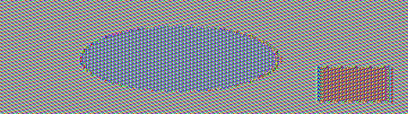

# Logbook for Lab 3 - Secret-Key Encryption Lab

## Purpose

The main objective of this lab was to deepen practical understanding of secret-key encryption by exploring various symmetric encryption algorithms, modes of operation, padding mechanisms, initialization vectors (IVs), and error propagation effects. Through a sequence of hands-on tasks, we were challenged to perform frequency analysis to manually decrypt a cipher, visually compare encryption modes (ECB vs. CBC), examine padding requirements in block ciphers, evaluate the security implications of IV reuse and predictability, and implement key recovery techniques using scripting. By combining theory with practical tools such as OpenSSL and Python libraries, the lab aimed to strengthen our analytical skills and technical proficiency in cryptographic implementations.


## Task 1: Frequency Analysis 

This first task aimed to discover the original text using frequency analysis. Originally, there was a random encryption key used to change letters into others.

In the page of Wikipedia that talks about frequency analysis it says that:

- **e, t,** and **a** are the most common letters in that same order

- **th** is the most common bigram

- **the** is the most common trigram


### Step 1: Identifying Common Character Patterns


Using frequency analysis, we discovered the most used n-grams:

- 1-gram: n

- 2-gram: yt

- 3-gram: ytn

Comparing these with common English n-grams as seen on Wikipedia:

- 1-gram: e

- 2-gram: th

- 3-gram: the

### Step 2: Initial Substitution

Using this information, we made our first substitution:

```bash
tr 'ytn' 'THE' < ciphertext.txt > out.txt
```

By substituting the most frequent characters, we observed patterns:

- THEd and dET suggest d → Y

- THvT likely represents THAT

- Tx is likely TO

### Step 3: Further Refinements

Applying the substitution:

```bash
tr 'ytndvx' 'THEYAO' < ciphertext.txt > out.txt
```

After inspecting the output, additional patterns were found:

- OuE and uO → u → N

- AuOTHEh → h → R

- hEAiiY → i → L

- lHO and lAY → l → W

Updating the translation command:

```bash
tr 'ytndvxuhil' 'THEYAONRLW' < ciphertext.txt > out.txt
```

Additional mappings were identified:

- gETWEEN and gY → g → B

- TzRN  ON → z → U

- YEARq and TzRNq → q → S

- NEfER and HAfE → f → V

- AHEAp and AWARpq → p → D

- bEW ANp bAR gETWEEN → b → F

Updating the translation command:

```bash
tr 'ytndvxuhilgzqfpb' 'THEYAONRLWBUSVDF' < ciphertext.txt > out.txt
```

The final step involved detecting the remaining letters:

- AS mT and BEHmND → m → I

- aLOSED DOORS → a → C

- THOUrH → r → G

- NOcmNATmONS → c → M

- AeeARENTLY → e → P

- UNEjUALLY → j → Q

- SEkmST → k → X

- oUST → o → J

- WEEsEND → s → K

- eRmwE → w → M

Final translation command:

```bash
tr 'ytndvxuhilgzqfpbmarcejkosw' 'THEYAONRLWBUSVDFICGMPQXJKM' < ciphertext.txt > out.txt
```

With this, we successfully decrypted the text.

```plaintext
THE OSCARS TURN  ON SUNDAY WHICH SEEMS ABOUT RIGHT AFTER THIS LONG STRANGE
AWARDS TRIP THE BAGGER FEELS LIKE A NONAGENARIAN TOO

THE AWARDS RACE WAS BOOKENDED BY THE DEMISE OF HARVEY WEINSTEIN AT ITS OUTSET
AND THE APPARENT IMPLOSION OF HIS FILM COMPANY AT THE END AND IT WAS SHAPED BY
THE EMERGENCE OF METOO TIMES UP BLACKGOWN POLITICS ARMCANDY ACTIVISM AND
A NATIONAL CONVERSATION AS BRIEF AND MAD AS A FEVER DREAM ABOUT WHETHER THERE
OUGHT TO BE A PRESIDENT WINFREY THE SEASON DIDNT JUST SEEM EXTRA LONG IT WAS
EXTRA LONG BECAUSE THE OSCARS WERE MOVED TO THE FIRST WEEKEND IN MARCH TO
AVOID CONFLICTING WITH THE CLOSING CEREMONY OF THE WINTER OLYMPICS THANKS
PYEONGCHANG

ONE BIG QUESTION SURROUNDING THIS YEARS ACADEMY AWARDS IS HOW OR IF THE
CEREMONY WILL ADDRESS METOO ESPECIALLY AFTER THE GOLDEN GLOBES WHICH BECAME
A JUBILANT COMINGOUT PARTY FOR TIMES UP THE MOVEMENT SPEARHEADED BY 
POWERFUL HOLLYWOOD WOMEN WHO HELPED RAISE MILLIONS OF DOLLARS TO FIGHT SEXUAL
HARASSMENT AROUND THE COUNTRY

SIGNALING THEIR SUPPORT GOLDEN GLOBES ATTENDEES SWATHED THEMSELVES IN BLACK
SPORTED LAPEL PINS AND SOUNDED OFF ABOUT SEXIST POWER IMBALANCES FROM THE RED
CARPET AND THE STAGE ON THE AIR E WAS CALLED OUT ABOUT PAY INEQUITY AFTER
ITS FORMER ANCHOR CATT SADLER QUIT ONCE SHE LEARNED THAT SHE WAS MAKING FAR
LESS THAN A MALE COHOST AND DURING THE CEREMONY NATALIE PORTMAN TOOK A BLUNT
AND SATISFYING DIG AT THE ALLMALE ROSTER OF NOMINATED DIRECTORS HOW COULD
THAT BE TOPPED

AS IT TURNS OUT AT LEAST IN TERMS OF THE OSCARS IT PROBABLY WONT BE

WOMEN INVOLVED IN TIMES UP SAID THAT ALTHOUGH THE GLOBES SIGNIFIED THE
INITIATIVES LAUNCH THEY NEVER INTENDED IT TO BE JUST AN AWARDS SEASON
CAMPAIGN OR ONE THAT BECAME ASSOCIATED ONLY WITH REDCARPET ACTIONS INSTEAD
A SPOKESWOMAN SAID THE GROUP IS WORKING BEHIND CLOSED DOORS AND HAS SINCE
AMASSED  MILLION FOR ITS LEGAL DEFENSE FUND WHICH AFTER THE GLOBES WAS
FLOODED WITH THOUSANDS OF DONATIONS OF  OR LESS FROM PEOPLE IN SOME 
COUNTRIES


NO CALL TO WEAR BLACK GOWNS WENT OUT IN ADVANCE OF THE OSCARS THOUGH THE
MOVEMENT WILL ALMOST CERTAINLY BE REFERENCED BEFORE AND DURING THE CEREMONY 
ESPECIALLY SINCE VOCAL METOO SUPPORTERS LIKE ASHLEY JUDD LAURA DERN AND
NICOLE KIDMAN ARE SCHEDULED PRESENTERS

ANOTHER FEATURE OF THIS SEASON NO ONE REALLY KNOWS WHO IS GOING TO WIN BEST
PICTURE ARGUABLY THIS HAPPENS A LOT OF THE TIME INARGUABLY THE NAILBITER
NARRATIVE ONLY SERVES THE AWARDS HYPE MACHINE BUT OFTEN THE PEOPLE FORECASTING
THE RACE SOCALLED OSCAROLOGISTS CAN MAKE ONLY EDUCATED GUESSES

THE WAY THE ACADEMY TABULATES THE BIG WINNER DOESNT HELP IN EVERY OTHER
CATEGORY THE NOMINEE WITH THE MOST VOTES WINS BUT IN THE BEST PICTURE
CATEGORY VOTERS ARE ASKED TO LIST THEIR TOP MOVIES IN PREFERENTIAL ORDER IF A
MOVIE GETS MORE THAN  PERCENT OF THE FIRSTPLACE VOTES IT WINS WHEN NO
MOVIE MANAGES THAT THE ONE WITH THE FEWEST FIRSTPLACE VOTES IS ELIMINATED AND
ITS VOTES ARE REDISTRIBUTED TO THE MOVIES THAT GARNERED THE ELIMINATED BALLOTS
SECONDPLACE VOTES AND THIS CONTINUES UNTIL A WINNER EMERGES

IT IS ALL TERRIBLY CONFUSING BUT APPARENTLY THE CONSENSUS FAVORITE COMES OUT
AHEAD IN THE END THIS MEANS THAT ENDOFSEASON AWARDS CHATTER INVARIABLY
INVOLVES TORTURED SPECULATION ABOUT WHICH FILM WOULD MOST LIKELY BE VOTERS
SECOND OR THIRD FAVORITE AND THEN EQUALLY TORTURED CONCLUSIONS ABOUT WHICH
FILM MIGHT PREVAIL

IN  IT WAS A TOSSUP BETWEEN BOYHOOD AND THE EVENTUAL WINNER BIRDMAN
IN  WITH LOTS OF EXPERTS BETTING ON THE REVENANT OR THE BIG SHORT THE
PRIME WENT TO SPOTLIGHT LAST YEAR NEARLY ALL THE FORECASTERS DECLARED LA
LA LAND THE PRESUMPTIVE WINNER AND FOR TWO AND A HALF MINUTES THEY WERE
CORRECT BEFORE AN ENVELOPE SNAFU WAS REVEALED AND THE RIGHTFUL WINNER
MOONLIGHT WAS CROWNED

THIS YEAR AWARDS WATCHERS ARE UNEQUALLY DIVIDED BETWEEN THREE BILLBOARDS
OUTSIDE EBBING MISSOURI THE FAVORITE AND THE SHAPE OF WATER WHICH IS
THE BAGGERS PREDICTION WITH A FEW FORECASTING A HAIL MARY WIN FOR GET OUT

BUT ALL OF THOSE FILMS HAVE HISTORICAL OSCARVOTING PATTERNS AGAINST THEM THE
SHAPE OF WATER HAS  NOMINATIONS MORE THAN ANY OTHER FILM AND WAS ALSO
NAMED THE YEARS BEST BY THE PRODUCERS AND DIRECTORS GUILDS YET IT WAS NOT
NOMINATED FOR A SCREEN ACTORS GUILD AWARD FOR BEST ENSEMBLE AND NO FILM HAS
WON BEST PICTURE WITHOUT PREVIOUSLY LANDING AT LEAST THE ACTORS NOMINATION
SINCE BRAVEHEART IN  THIS YEAR THE BEST ENSEMBLE SAG ENDED UP GOING TO
THREE BILLBOARDS WHICH IS SIGNIFICANT BECAUSE ACTORS MAKE UP THE ACADEMYS
LARGEST BRANCH THAT FILM WHILE DIVISIVE ALSO WON THE BEST DRAMA GOLDEN GLOBE
AND THE BAFTA BUT ITS FILMMAKER MARTIN MCDONAGH WAS NOT NOMINATED FOR BEST
DIRECTOR AND APART FROM ARGO MOVIES THAT LAND BEST PICTURE WITHOUT ALSO
EARNING BEST DIRECTOR NOMINATIONS ARE FEW AND FAR BETWEEN
```

## Task 2: Encryption using Different Ciphers and Modes

In  this  task,  we  experimented using various  encryption  algorithms  and  modes to encrypt a file.

To determine available encryption ciphers, we used:

```bash
openssl enc -ciphers
```

### Step 1: Encrypting with RC4

```bash
openssl enc -rc4 -e -in plaintext.txt -out cipher1.bin -K 00112233445566778889aabbccddeeff -iv 0102030405060708 -p
```

- **rc4**: Rivest Cipher 4, a stream cipher using variable key sizes, operates on byte-oriented data with high speed but is considered insecure.

- **Result**:

```plaintext
warning: iv not used by this cipher
salt=2013000000000000
key=00112233445566778889AABBCCDDEEFF
```

### Step 2: Encrypting with Blowfish (CFB Mode)

```bash
openssl enc -bf-cfb -e -in plaintext.txt -out cipher2.bin -K 00112233445566778889aabbccddeeff -iv 0102030405060708 -p
```

- **bf-cfb**: Blowfish in Cipher Feedback (CFB) mode, a symmetric-key block cipher with a 64-bit block size, 16-round Feistel structure, and variable key lengths from 32 to 448 bits.

- **Result**:

```plaintext
salt=2013000000000000
key=00112233445566778889AABBCCDDEEFF
iv =0102030405060708
```

### Step 3: Encrypting with Camellia-256

```bash
openssl enc -camellia256 -e -in plaintext.txt -out cipher3.bin -K 00112233445566778889aabbccddeeff -iv 0102030405060708 -p
```

- **camellia256**:  Camellia with a 256-bit key, a Feistel-based block cipher with a 128-bit block size, optimized for both hardware and software, with a security level comparable to AES.

- **Result**:

```plaintext
hex string is too short, padding with zero bytes to length
salt=2013000000000000
key=00112233445566778889AABBCCDDEEFF00000000000000000000000000000000
iv =01020304050607080000000000000000
```

### Step 4: Encrypting with ChaCha20

```bash
openssl enc -chacha20 -e -in plaintext.txt -out cipher4.bin -K 00112233445566778889aabbccddeeff -iv 0102030405060708 -p
```

**chacha20**: A stream cipher using a 256-bit key, 20 rounds of quarter-round operations, high-performance, secure, and resistant to timing attacks.

- **Result**:

```plaintext
hex string is too short, padding with zero bytes to length
salt=2013000000000000
key=00112233445566778889AABBCCDDEEFF00000000000000000000000000000000
iv =01020304050607080000000000000000
```

## Task 3: Encryption Mode – ECB vs. CBC

In this task, we encrypted a picture using ECB (Electronic Code Book) and CBC (Cipher Block Chaining) modes, so people
without the encryption keys cannot know what is in the picture. After that, derive any useful information about the original picture
from the encrypted picture.

### Step 1: Visualizing the Original Picture

For this we installed the `eog` image viewer:

```bash
sudo apt install eog
```

Then, we displayed the original picture:

```bash
eog pic_original.bmp
```


### Step 2: Encrypting with ECB Mode

The first 54 bytes contain the header information about the picture, we had
to set it correctly, so that the encrypted file can be treated as a legitimate .bmp file.

First, we encrypted the picture with ECB mode using the same method as before:

```bash
openssl enc -aes-128-ecb -e -in pic_original.bmp -out pic_ecb.bmp -K 00112233445566778889aabbccddeeff -iv 0102030405060708
```

To make sure that the information about the picture is not lost, we had to replace the
header of the encrypted picture with that of the original picture. We used the following commands:

```bash
head -c 54 pic_original.bmp > header
tail -c +55 pic_ecb.bmp > body
cat header body > new_pic_ecb.bmp
```

Finally, we displayed the encrypted picture using the `eog` image viewer:



We can check that the encrypted picture using the ECB mode has a lot of information from the original one and it looks very similar.

### Step 3: Encrypting with CBC Mode

We repeated the process with CBC mode:

```bash
openssl enc -aes-128-cbc -e -in pic_original.bmp -out pic_cbc.bmp -K 00112233445566778889aabbccddeeff -iv 0102030405060708
```

```bash
head -c 54 pic_original.bmp > header
tail -c +55 pic_cbc.bmp > body
cat header body > new_pic_cbc.bmp
```


By displaying the encrypted picture, we can see that the CBC mode encryption has a more random appearance compared to the ECB mode.
We can not see any information from the original picture in the encrypted one.

### Step 4: Test using another picture

For this step we gathered another picture from the website [https://www.filesampleshub.com/format/image/bmp](https://www.filesampleshub.com/format/image/bmp).
And applied the same logic as before.

The original picture:


The encrypted picture using ECB mode:


The encrypted picture using CBC mode:


In this case, we can see that, since the picture is more complex, the encrypted pictures are more similar to each other.
We can see a little of the outline of the original picture in the ECB mode, but nothing that can be identified.
In the CBC mode, we can not see any information from the original picture.

## Task 4: Padding

In this task, we check that for block ciphers, when the size of a plaintext is
not a multiple of the block size, padding may be required.

### Step 1: Create a 5-byte Plaintext File

```bash
echo -n "12345" > f1.txt
echo "12345" > f1.txt
```

### Step 2: Check which of the ECB, CBC, CFB, and OFB modes require padding

For that, we encrypted the file using each mode:

```bash
openssl enc -aes-128-ecb -e -in f1.txt -out f1_ecb.bin -K 00112233445566778889aabbccddeeff
```

```bash
openssl enc -aes-128-cbc -e -in f1.txt -out f1_cbc.bin -K 00112233445566778889aabbccddeeff -iv 0102030405060708
```

```bash
openssl enc -aes-128-cfb -e -in f1.txt -out f1_cfb.bin -K 00112233445566778889aabbccddeeff -iv 0102030405060708
```

```bash
openssl enc -aes-128-ofb -e -in f1.txt -out f1_ofb.bin -K 00112233445566778889aabbccddeeff -iv 0102030405060708
```

To check the size of each file, we used:

```bash
ls -l f1_ecb.bin f1_cbc.bin f1_cfb.bin f1_ofb.bin
```


From the output, we can see that the CFB and OFB modes still have the same size as the plaintext file (5 bytes), while the CBC and ECB modes have a larger size (16 bytes).

**CFB** converts a block cipher into a stream cipher by XORing the plaintext with encrypted feedback. Since encryption is performed byte-by-byte (or bit-by-bit, depending on segment size), it does not require padding.

**OFB**, like CFB, turns a block cipher into a stream cipher by generating a keystream independently of the plaintext. Because it does not require fixed block sizes for encryption, no padding is needed.

### Step 3: Create three files, which are 5, 10, and 16 bytes long

```bash
echo -n "12345" > f1.txt
echo -n "1234567890" > f2.txt
echo -n "1234567890123456" > f3.txt
```

### Step 4: Encrypt the files using 128-bit AES with CBC mode

```bash
openssl enc -aes-128-cbc -e -in f1.txt -out f1_cbc.bin -K 00112233445566778889aabbccddeeff -iv 0102030405060708
openssl enc -aes-128-cbc -e -in f2.txt -out f2_cbc.bin -K 00112233445566778889aabbccddeeff -iv 0102030405060708
openssl enc -aes-128-cbc -e -in f3.txt -out f3_cbc.bin -K 00112233445566778889aabbccddeeff -iv 0102030405060708
```

### Step 5: Describe the size of the encrypted files

```bash
ls -l f1_cbc.bin f2_cbc.bin f3_cbc.bin
```


From the output, we can see that the 5 and 10-byte files have a size of 16 bytes, while the 16-byte file has a size of 32 bytes.
This is because the block size of AES is 16 bytes, so the files are padded to the next multiple of 16.

### Step 6: Decrypt the files to check the padding

First, we decrypted the files:

```bash
openssl enc -aes-128-cbc -d -nopad -in f1_cbc.bin -out f1_dec.txt -K 00112233445566778889aabbccddeeff -iv 0102030405060708
openssl enc -aes-128-cbc -d -nopad -in f2_cbc.bin -out f2_dec.txt -K 00112233445566778889aabbccddeeff -iv 0102030405060708
openssl enc -aes-128-cbc -d -nopad -in f3_cbc.bin -out f3_dec.txt -K 00112233445566778889aabbccddeeff -iv 0102030405060708
```

Then, we checked the contents of the decrypted files:

```bash
hexdump -C f1_dec.txt
hexdump -C f2_dec.txt
hexdump -C f3_dec.txt
```

Since AES has a 16-byte block size the padding used is PKCS#7, which adds n bytes of value n to the plaintext to reach the next multiple of 16.


The original data ("12345", 5 bytes) was too short for the 16-byte AES block, so PKCS#7 padding added eleven (0x0B) bytes to fill the block.


The original data ("1234567890", 10 bytes) needed 6 extra bytes to reach the 16-byte block size, so PKCS#7 padding added 0x06 bytes.


Even though the input was exactly 16 bytes (a full AES block), PKCS#7 padding always adds a full extra block when the data is already aligned. This is because when decrypting, the system removes exactly n bytes of 0x10 padding, ensuring correctness.

## Task 5: Error Propagation – Corrupted Cipher Text

```plaintext
Alice, a curious young girl, follows a hurried White Rabbit down a hole, tumbling into Wonderland, a bizarre realm of talking animals, magical food, and eccentric characters. She grows and shrinks unpredictably, meets the grinning Cheshire Cat, and attends a nonsensical tea party with the Mad Hatter. She encounters the tyrannical Queen of Hearts, who orders beheadings at whim. Navigating Wonderland’s absurd logic, Alice questions reality and identity. During a chaotic trial, she finally asserts herself—only to awaken and realize it was all a dream. A whimsical tale of adventure, imagination, and self-discovery, Alice’s Adventures in Wonderland remains a timeless classic, beloved for its witty wordplay, satire, and fantastical imagery. Its exploration of childhood curiosity and the nonsensical nature of rules continues to captivate readers of all ages, inspiring countless adaptations and interpretations in literature, film, and beyond. These are extra characters to fill the space
```


## Task 6: Initial Vector (IV) and Common Mistakes

Most of the encryption modes require an initial vector (IV). Properties of an IV depend on the cryptographic
scheme used. If we are not careful in selecting IVs, the data encrypted by us may not be secure at all, even
though we are using a secure encryption algorithm and mode.

### Step 1: Experiment with IVs

We encrypted the same plaintext using (1) two different IVs, and (2) the same IV.


As we can see, the file encrypted with the same IV as the original file is identical to the original file, while the file encrypted with a different IV is completly different. This shows the importance of using a secure IV and why they should be unique for each encryption.

### Step 2: Decypting a cyphertext from its plaintext

For this step we were given a plaintext, its corresponding ciphertext and another ciphertext that was encrypted using the same IV.
Our task was to discover what was the plaintext that originated the second ciphertext using Output Feedback (OFB) mode.

Plaintext 1: "This is a known message!"

Ciphertext 1: "a469b1c502c1cab966965e50425438e1bb1b5f9037a4c159"

Plaintext 2: ?

Ciphertext 2: "bf73bcd3509299d566c35b5d450337e1bb175f903fafc159"

For this we used the following python file:

```python
#!/usr/bin/python3

# XOR two bytearrays
def xor(first, second):
   return bytearray(x^y for x,y in zip(first, second))

MSG   = "This is a known message!"
HEX_1 = "a469b1c502c1cab966965e50425438e1bb1b5f9037a4c159"
HEX_2 = "bf73bcd3509299d566c35b5d450337e1bb175f903fafc159"

# Convert ascii string to bytearray
D1 = bytes(MSG, 'utf-8')

# Convert hex string to bytearray
D2 = bytearray.fromhex(HEX_1)
D3 = bytearray.fromhex(HEX_2)

r1 = xor(D1, D2)
r2 = xor(D2, D3)
r3 = xor(D2, D2)
print(r1.hex())
print(r2.hex())
print(r3.hex())


P2 = xor(D1, r2)

print("Recovered P2 (hex):", P2.hex())
print("Recovered P2 (ASCII):", P2.decode(errors="replace"))
```

The output is as follows:


The recovered plaintext is: `Order: Launch a missile!`

### Step 3: Replacing OFB with CBC mode

If we were to replace OFB mode with CBC mode, the recovered plaintext would be different. This is because the XOR operation in CBC mode is between the previous ciphertext block and the current plaintext block, while in OFB mode it is between the IV and the current plaintext block. Thus, we would not be able to recover the plaintext.

### Step 4: Common Mistake: Use a Predictable IV

This step aims to show how dangerous it can be to use a predictable IV. IVs should
be unpredictable for many schemes, i.e., IVs need to be randomly generated.

We asssume that Bob just sent out an encrypted message, and Eve knows that its content is either Yes or
No; Eve can see the ciphertext and the IV used to encrypt the message, but since the encryption algorithm
AES is quite strong, Eve has no idea what the actual content is. However, since Bob uses predictable IVs,
Eve knows exactly what IV Bob is going to use next.

To simulate this we need to have the setup docker compose running and then run the following command:

```bash
nc 10.9.0.80 3000
```

This will output the following:


After showing you the next IV, the oracle will ask you to input a plaintext message (as a hex string).
The oracle will encrypt the message with the next IV, and outputs the new ciphertext.

Our job was to figure out whether the actual content of Bob’s secret message is Yes or No.

To solve this we used the following python script:

```python
#!/usr/bin/python3

# XOR two bytearrays
def xor(first, second):
   return bytearray(x^y for x,y in zip(first, second))

message = "Yes"

iv = "6243ad9204a87a6dcdb4ae1eaf80558a"
next_iv = "e0e497cf04a87a6dcdb4ae1eaf80558a"

d1 = bytearray(message, 'utf-8')
pad = 16 - len(d1) % 16
d1 += bytes([pad])*pad

d2 = bytearray.fromhex(iv)
d3 = bytearray.fromhex(next_iv)

# xor
r1 = xor(d1, d2)
r2 = xor(r1, d3)

print(r2.hex())
```

The output was:

```plaintext
dbc249500d0d0d0d0d0d0d0d0d0d0d0d
```

Now we can use this output to decrypt the message using the oracle, we just need to input the hex string `dbc249500d0d0d0d0d0d0d0d0d0d0d0d` and the oracle will output the ciphertext:


We can see that the cyphertext outputed corresponds to the original Bob cyphertext, so we can conclude that the message is `Yes`.

## Task 7: Programming using the Crypto Library

In this task, we were given a plaintext and a ciphertext, and our job was to find the key that is used for the
encryption.

We also were given the following information:

- The aes-128-cbc cipher is used for the encryption.
- The key used to encrypt this plaintext is an English word shorter than 16 characters; the word can be
found from a typical English dictionary. Since the word has less than 16 characters (i.e. 128 bits),
pound signs (#: hexadecimal value is 0x23) are appended to the end of the word to form a key of
128 bits.

### Step 1: Create a Python Script to Decrypt the Message

We created a Python script to decrypt the message using the Crypto library:

```python
from Crypto.Cipher import AES
from Crypto.Util.Padding import unpad
import binascii

ciphertext_hex = '764aa26b55a4da654df6b19e4bce00f4ed05e09346fb0e762583cb7da2ac93a2'
iv_hex = 'aabbccddeeff00998877665544332211'
ciphertext = binascii.unhexlify(ciphertext_hex)
iv = binascii.unhexlify(iv_hex)

def decrypt_with_key(key):
    cipher = AES.new(key, AES.MODE_CBC, iv)
    decrypted = cipher.decrypt(ciphertext)
    try:
        return unpad(decrypted, AES.block_size).decode('utf-8')
    except (ValueError, UnicodeDecodeError):
        return None

with open('words.txt', 'r') as file:
    for line in file:
        word = line.strip()
        if len(word) <= 16:
            key = (word + '#' * (16 - len(word))).encode('utf-8')
            decrypted_text = decrypt_with_key(key)
            if decrypted_text:
                print(f'Success! The key is: "{word}"')
                print(f'Decrypted text: "{decrypted_text}"')
                break
    else:
        print('No valid key found in the word list.')
```

The script reads a list of English words from a file that was already provided, `words.txt`, and attempts to decrypt the ciphertext using each word as a key. If the decryption is successful, the key is printed along with the decrypted text.

### Step 2: Find the Key

We ran the script and found the key:


The key used to encrypt the plaintext was `Syracuse`.

## Conclusion

This lab provided valuable insights into the real-world behavior of symmetric encryption schemes. Frequency analysis illustrated the vulnerability of simple substitution ciphers. The comparison between ECB and CBC modes revealed that ECB fails to conceal visual patterns, while CBC effectively masks original content. Analysis of encryption modes clarified which require padding, highlighting the role of PKCS#7. Tasks involving IVs demonstrated the necessity of using unpredictable, unique IVs to maintain confidentiality. The OFB mode exercise showcased how certain stream cipher properties can be exploited for plaintext recovery. Finally, the dictionary attack implemented in Python successfully uncovered an encryption key, emphasizing the importance of key entropy and secure key management. Overall, the lab reinforced critical concepts in cryptography and highlighted common implementation pitfalls that must be avoided in secure systems.
