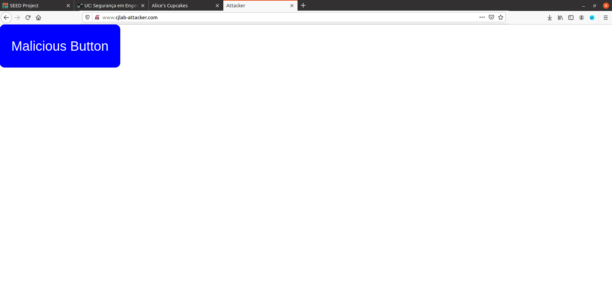
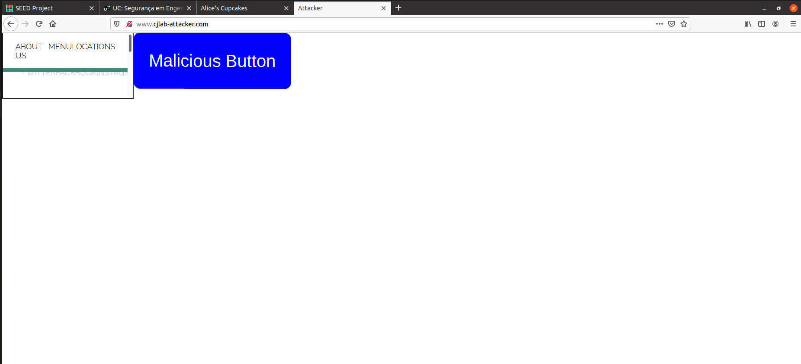

# Logbook for Lab 04

## Purpose

Clickjacking, also known as a “UI redress attack,” is an attack that tricks a user into clicking on something they do not intend to when visiting a webpage, thus “hijacking” the click. In this lab, we will explore a common attack vector for clickjacking: the attacker creates a webpage that loads the content of a legitimate
page but overlays one or more of its buttons with invisible button(s) that trigger malicious actions. When a user attempts to click on the legitimate page’s buttons, the browser registers a click on the invisible button instead, triggering the malicious action.

### Example Scenario

Suppose an attacker acquires the domain `starbux.com` and creates a website with that URL. The site first loads the legitimate target website `starbucks.com` in an iframe element spanning the entire webpage, so that the malicious `starbux.com` website looks identical to the legitimate `starbucks.com` website. The attacker’s site then places an invisible button on top of the ‘Menu’ button on the displayed `starbucks` page; the button triggers a 1-click purchase of the attacker’s product on Amazon. If the user is logged on to Amazon when they try to click the legitimate button, the inadvertent click on the invisible button will make the unintended purchase without the user’s knowledge or consent.


## Task 0


### Step 0.1 - Understanding the Lab

In this lab, we will use two websites. 

- The first is the vulnerable homepage of the fictional business “Alice’s Cupcakes”, accessible at [`http://www.cjlab.com`](http://www.cjlab.com). 
- The second is the attacker’s malicious web site that is used for hijacking clicks intended for the Alice’s Cupcakes page, accessible at [`http://www.cjlab-attacker.com`](http://www.cjlab-attacker.com).

### Step 0.2 - DNS Configuration

We use containers to set up the web servers.

We use two containers: 
- one running the website for Alice’s Cupcakes 
  - the “defender”, with IP address 10.9.0.5
- and the other running the website for the attacker 
  - with IP address 10.9.0.105. 
  
The IP addresses for these two containers must be consistent in the docker-compose.yml file and the /etc/hosts file (see below), and we recommend not changing them from their default values.

So we added the following lines to the `/etc/hosts` file in the VM:

```bash
# For Clickjack Lab
10.9.0.5        www.cjlab.com
10.9.0.105      www.cjlab-attacker.com
```

### Step 0.3 - The Defender Container

The website for Alice’s Cupcakes is hosted on an Apache web server. The web-site setup is included in `apache_defender.conf` inside the defender image folder. `

The configuration specifies the URL for the website and the folder where the web application code is stored. The configuration also contains placeholders for HTTP response headers returned by the server (commented out), which will  be filled in during the course of the lab as a defense countermeasure.

```conf
<VirtualHost *:80>
    DocumentRoot /var/www/defender
    ServerName www.cjlab.com
    # Header set <Header-name> "<value>";
    # Header set Content-Security-Policy " \
        # <directive> ’<value>’; \
    # "
</VirtualHost>
```

Because we need to modify the defender’s web page inside this container, for convenience as well as to allow the modified files to persist beyond the containers, we have mounted a folder (`Labsetup/defender` on the hosting VM) to the container’s `/var/www/defender` folder, which is the `DocumentRoot` folder in our Apache configuration. 

Therefore any files we modify inside the `defender` folder on the VM will be seen as modified by the defender’s web server on the container.

### Step 0.4 - The Attacker Container

The attacker’s website is also hosted on an Apache web server. The website setup is included in `apache_attacker.conf` inside the attacker image folder. 

The Apache configuration for this website is as follows:

```conf
<VirtualHost *:80>
    ServerName www.cjlab-attacker.com
    DocumentRoot "/var/www/attacker"
    DirectoryIndex attacker.html
</VirtualHost>
```

Because we need to modify the attacker’s web page inside this container, for convenience as well as to allow the modified files to persist beyond the containers, we have mounted a folder (`Labsetup/attacker` on the hosting VM) to the container’s `/var/www/attacker` folder, which is the `DocumentRoot` folder in our Apache configuration. 

Therefore any files we modify inside the `attacker` folder on the VM will be seen as modified by the attacker’s web server on the container.

*Note*: Any time we make updates to the websites, we may need to clear the browser’s cache and/or rebuild and restart the containers for the change to be visible, depending on the scope of the change.

### Step 0.5 - Test

|      Alice’s Cupcakes       |  Queen of Hearts' Cupcakes  |
|-----------------------------|-----------------------------|
|  |  |
|   Fig.1 Defender Website    |   Fig.2 Attacker Website    |

The goal of the attacker is to overlay the button from Queen of Hearts button onto a view of the Alice's webpage displayed on the Queen's site, so that a victim user will inadvertently click the malicious button when they think they are clicking a button on the Alice's webpage.


## Task 1 - Copy that site!

Our first step as the attacker is to add code to `attacker.html` so that it mimics the Alice’s Cupcakes website as closely as possible. A common way to do this is with an HTML Inline Frame element (“iframe”).

An iframe enables embedding one HTML page within another. The `src` attribute of the iframe specifies the site to be embedded, and when the iframe code is executed on a page, the embedded site is loaded into the iframe.

### Step 1.1 - Embed the defender’s site into the attacker’s site

After placing the line `<iframe src="http://www.cjlab.com" title="Queen of Hearts Cupcakes"></iframe>` in the `attacker.html` file, this is the result:

|         Queen of Hearts' Cupcakes           |
|---------------------------------------------|
|                  |
| Fig.3 Attacker Website with Defender iframe |

### Step 1.2 - Modify the attacker's CSS

In order to look inconspicuous, we need to change the `attacker.css` accordingly:

```css
iframe {
  width: 100vw;
  height: 100vh;
  border: 0;
}
```

With no further changes, the attacker website looks like this:

|         Queen of Hearts' Cupcakes           |
|---------------------------------------------|
|                  |
| Fig.4 Attacker Website with stylized iframe |

## Task 2 - Let’s Get Clickjacking!

### Step 2.1 - Update the Button's positioning

Firstly we changed the margin of the button in the `attacker.css` like so:

```css
button {
    color: white;  /* font color */
    background-color: blue;  /* button's background color */
    margin: 14.5% 0 0 2%;
}
```

This produced the following result:

|         Queen of Hearts' Cupcakes           |
|---------------------------------------------|
|                  |
| Fig.5 Attacker Website with stylized iframe |

Note: in order to save time, we sticked to a very simple positioning that may vary from screen resolution and zoom. Other margins may apply.

### Step 2.2 - Make the Button Mr. Invisible

Then, in order to make the button invisible we changed its `color` and `background-color` values to **transparent** like so:

```css
button {
    color: transparent;  /* font color */
    background-color: transparent;  /* button's background color */
    margin: 14.5% 0 0 2%;
}
```

This is the result of the changes:

|         Queen of Hearts' Cupcakes           |
|---------------------------------------------|
|                  |
| Fig.6 Attacker Website with stylized iframe |

### Questions

#### Question 1 - How does the appearance of the attacker’s site compare to that of the defender’s site?

As we can see from the previous image, we have managed to replicate the original website's appearence pretty easily with the `iframe`. The trickery is further enhanced by having a malicious button hidden in front of the "Explore Menu" button of the defender's website.


#### Question 2 - What happens when you click on the “Explore Menu” button on the attacker’s site?

Like explained in the previous question, we know that the malicious button is in front of the "Explore Menu" button. This means that if we click the "Explore Menu" button we will actually be clicking on the malicous button.

That said, as the code in the `attacker.html` would indicate, clicking the malicious button (which is on top of the "Explore Menu" button), it sends us to the `hacked.html` page like shown in Figure 7.

Note that this page redirection could be replaced with any script and redirect to any pages. The are significant hacking possibilities.

|  Queen of Hearts' Cupcakes   |
|------------------------------|
|   |
| Fig.7 You Have Been Hacked!! |

#### Question 3 - Describe an attack scenario in which the style of clickjacking implemented for this Task leads to undesirable consequences for a victim user.

Clicking in an invisible button may execute malicious scripts, like reading the Login fields (email and password) and send them to a bad actor.


## Task 3 - Bust That Frame!

Frame busting is a technique used to prevent a webpage from being displayed within a frame, protecting against certain attacks. This is done by adding script code to ensure the webpage remains the topmost window, preventing other sites from embedding it in an iframe and overlaying malicious buttons.


### Step 3.1 - Make the script

As stated in the Lab Script, we must update the `makeThisFrameOnTop` function located in the `defender/index.html` file.

In the end, it should look like this:


```js
function makeThisFrameOnTop() {
  if(window.top !== window.self){
    window.top.location = window.self.location;
  }
}
```

### Questions

#### Question 1 - What happens when you navigate to the attacker’s site now?

Now, when navigating to the attacker's website, it automatically redirects us to the defender's website.

#### Question 2 - What happens when you click the button?

When clicking the button, nothing happens (as intended).

Contrary to what happened before adding the function `makeThisFrameOnTop`, now the user cannot get attacked (at least through a Clickjacking attack).

## Task 4 - Attacker Countermeasure (Bust the Buster)

### Step 4.1 - Using Sandbox

For the `sandbox` to make effect, we just added it to the `iframe` in the `attacker.html` like so: `<iframe src="http://www.cjlab.com" title="Queen of Hearts Cupcakes" sandbox></iframe>`


### Questions

#### Question 1 - What does the sandbox attribute do? Why does this prevent the frame buster from working?

Essentially, the `sandbox` attribute enables an extra set of restrictions for the content in the iframe.

When the `sandbox` attribute is present, and it will, among other things: treat the content as being from a unique origin, disable APIs, and, most importantly, **block script execution**.

#### Question 2- What happens when you navigate to the attacker’s site after updating the iframe to use the sandbox attribute?

**After clearing the cache for the website**, when accessing the attacker's website, it no longer redirected us to the defender's website.

#### Question 3 - What happens when you click the button on the attacker’s site?

Like before, the Malicious Button still redirects us the `hacked.html` page.


## Task 5 - The Ultimate Bust

To prevent clickjacking attacks more effectively, server-side (back-end) defenses are needed since front-end defenses like frame busting can be bypassed.

Modern websites can use special HTTP headers to instruct browsers on when and how content should be displayed, blocking attackers from embedding their pages in frames. 

Two key headers for this purpose are X-Frame-Options and Content-Security-Policy (CSP). The CSP directive "frame-ancestors" specifies which sites are allowed to embed a page in a frame, helping prevent clickjacking while maintaining legitimate content-sharing functionality.

### Step 5.1 - Modify the defender’s response headers

Uncommenting the lines in `image_defender/apache_defender.conf` file that specify the HTTP response headers that are served with the page.

We then substituted the appropriate text in order to prevent the clickjacking attack. Specifically, we set the X-Frame-Options (XFO) header to the value `"DENY"` and the Content-Security-Policy (CSP) header to contain the directive `"frame-ancestors 'none'"`.

After the changes are made, the file should look like this:

```apache
<VirtualHost *:80>
    DocumentRoot /var/www/defender
    ServerName www.cjlab.com
    Header set X-Frame-Options "DENY"
    Header set Content-Security-Policy "frame-ancestors 'none';"
</VirtualHost>
```

Now, when trying to open the attacker's website, it shows us the following screen:

|     Queen of Hearts' Cupcakes      |
|------------------------------------|
|         |
| Fig.8 Browser Can't Open this Page |

### Questions

#### Question 1 - What is the X-Frame-Options HTTP header attribute, and why is it set to “DENY” to prevent the attack?

The X-Frame-Options HTTP header prevents clickjacking attacks by controlling whether a webpage can be embedded in an `<iframe>`. 
Setting it to "DENY" ensures that the page cannot be framed by any site, blocking attackers from tricking users into clicking hidden elements.

#### Question 2 - What is the Content-Security-Policy header attribute, and why is it set to “frame-ancestors ‘none’ ” to prevent the attack?

The Content-Security-Policy (CSP) header enhances web security by restricting how resources (e.g., scripts, frames) can be loaded on a page.

The directive frame-ancestors 'none' prevents the site from being embedded in an `<iframe>`, `<embed>`, or `<object>`, essentially blocking clickjacking attacks. 

This approach is more flexible and modern than X-Frame-Options, ensuring better protection across different browsers.

#### Question 3 - What happens when you navigate to the attacker’s site after modifying each response header (one at a time)? What do you see when you click the button?

When navigating to the attacker's website after modifying the response header, it shows us the same screen independently of what response header is denying the `<iframe>`, like shown in Figure 8.

When clicking the button shown, it redirects us to the website contained in the `<iframe>`, which, in this case, is the Alice's Cupcakes in `http://www.cjlab.com/index.html`.

<hr>

End of Logbook for the Lab04

## Conclusion

This lab provided a practical exploration of clickjacking—a significant web security threat in which attackers deceive users into clicking on malicious content by overlaying invisible buttons or frames. By simulating both the attacker and defender roles, we gained hands-on insight into how easy it is to mimic a legitimate site and trick unsuspecting users.

We observed that, with only a few lines of HTML and CSS, an attacker can effectively replicate a website and overlay malicious elements that are visually indistinguishable from the real interface. Our experiments demonstrated that a simple iframe and invisible button were enough to compromise user actions and redirect them to unintended destinations.

The lab then guided us through increasingly effective countermeasures. First, we implemented client-side "frame busting" scripts, which prevent a site from being embedded in an iframe. We also saw how the `sandbox` attribute could be abused by attackers to circumvent such scripts. Ultimately, the most robust defense came from server-side headers, such as `X-Frame-Options: DENY` and `Content-Security-Policy: frame-ancestors 'none'`, which directly instruct the browser not to render the site in a frame, neutralizing clickjacking attempts.

Through this progression, the lab made clear that while front-end mitigations offer some protection, only strong server-side controls can reliably secure web applications against clickjacking. This hands-on approach reinforced the importance of layered defenses and highlighted how modern web security relies on a combination of browser capabilities and explicit developer safeguards.
